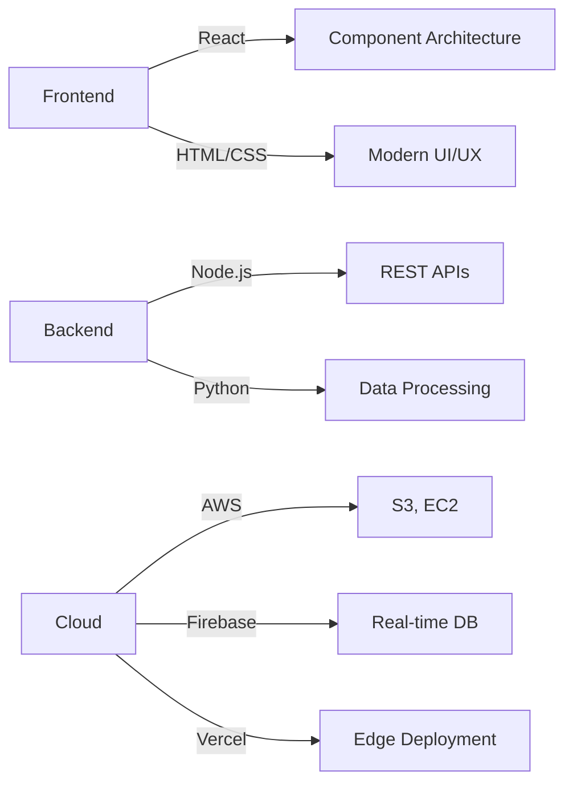

# Emmett Shaughnessy

**Full-Stack Developer | Technical Consultant | Builder**

---

## 🚀 Current Projects

<table>
<tr>
<td width="50%">

### [Qube TX](https://qubetx.com)
**Freelance Development Studio**

Building custom solutions for clients who need reliable, modern web applications.

`React` `Node.js` `Cloud Infrastructure`

</td>
<td width="50%">

### [QorkMe](https://qork.me)
**URL Shortening Service**

Clean, efficient URL shortening with custom aliases and analytics tracking.

`Full-Stack` `API Design` `Data Management`

</td>
</tr>
<tr>
<td width="50%">

### [ToolDoBox](https://app.tooldobox.com)
**Productivity Platform**

All-in-one toolset for streamlining workflows and managing daily tasks.

`React` `Firebase` `Cloud Functions`

</td>
<td width="50%">

### [Personal Site](https://emmettshaughnessy.com)
**Digital Portfolio**

Professional showcase and technical writing hub.

`Modern Web` `Responsive Design` `Performance`

</td>
</tr>
</table>

## 💻 Tech Stack

### Languages

### Frameworks & Libraries

### Cloud & Infrastructure

### Specializations
- 🤖 **AI & ML Integration** – Building intelligent applications with modern AI tooling
- 🏗️ **Full-Stack Architecture** – End-to-end application development and deployment
- ⚡ **Performance Optimization** – Fast, efficient, scalable solutions
- 🔧 **Technical Consulting** – Problem-solving for complex technical challenges

---

**Building reliable, maintainable solutions that solve real problems.**

