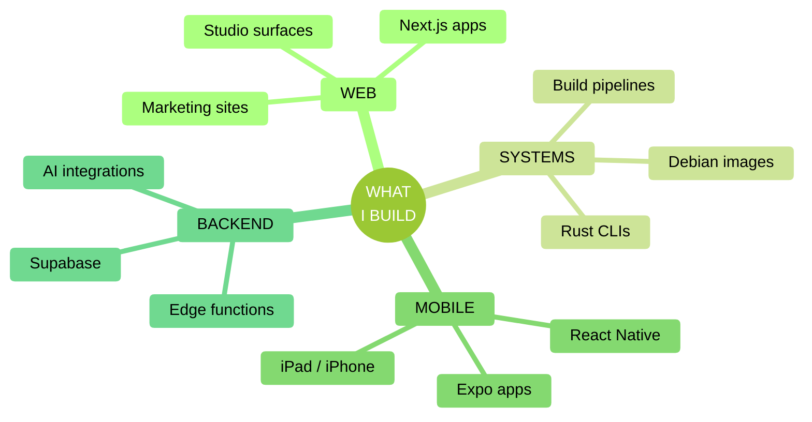

<!-- ====================================================================== -->
<!--  EMMETT SHAUGHNESSY · GITHUB PROFILE                                   -->
<!--                                                                        -->
<!--  Hand-built within the limits of GitHub's markdown sanitizer.          -->
<!--  No JavaScript, no CSS, no inline SVG, no GitHub Actions.              -->
<!--  Every dynamic element is GFM, a sanitizer-safe HTML tag, or a         -->
<!--  parameterized image URL rendered live on every page load.             -->
<!--                                                                        -->
<!--  Scroll to the COLOPHON at the bottom for the full catalogue of        -->
<!--  techniques used in this file.                                         -->
<!-- ====================================================================== -->

<picture>
  <source media="(prefers-color-scheme: dark)" srcset="https://capsule-render.vercel.app/api?type=waving&color=204F20&height=200&section=header&text=EMMETT%20SHAUGHNESSY&fontColor=F5E0C5&fontSize=52&fontAlignY=38&desc=DIGITAL%20CRAFTSMAN&descSize=16&descAlignY=58&descAlign=50&animation=fadeIn">
  
</picture>

<picture>
  <source media="(prefers-color-scheme: dark)" srcset="https://readme-typing-svg.demolab.com?font=Fira+Code&weight=600&size=20&duration=2400&pause=1200&color=F5E0C5&center=true&vCenter=true&width=640&lines=full-stack+developer+%C2%B7+rust+%2B+typescript;founder%2C+qube+tx+%C2%B7+diagnostics+%26+web+studio;building+magic+pantry%2C+dorsey+2026%2C+shaughv+os;shipping+reliable+systems+since+2017">
  
</picture>

 

 

I build full-stack products, Rust diagnostics, and the systems that ship them. Currently a workshop of Qube TX, Magic Pantry, Dorsey 2026, and the SHAUGHV brand system.

<kbd> Jump to </kbd>

&nbsp;

[`NOW`](#now) &nbsp;&middot;&nbsp; [`CURRENT WORK`](#current-work) &nbsp;&middot;&nbsp; [`STACK`](#stack) &nbsp;&middot;&nbsp; [`NUMBERS`](#numbers) &nbsp;&middot;&nbsp; [`COLOPHON`](#colophon)

---

## NOW

> [!NOTE]
> **MAY 2026, actively shipping**
>
> &middot; **TR-300 v3.15.2** published as the `tr300` crate ([`qube-machine-report`](https://github.com/QubeTX/qube-machine-report)) with all 28 release assets verified live across the four-installer Windows distribution + macOS + Linux; a three-agent Opus 4.7 1M-context cross-platform audit landed fixes for 19 of 22 install / update / runtime findings (SHA256 verification on every downloaded MSI / EXE, atomic temp-then-rename profile writes, marker-balance refusal on hand-mutilated profiles, msiexec 3010 surfaced as actionable JSON, 5-second WMI timeouts), and a v3.0.0 to v3.15.1 `HUMAN_CHANGELOG.md` backfill put the layperson history in lockstep with `CHANGELOG.md`.
> &middot; **`shaughv-cdn`** + **`shaughv-code`** brand-system rails: a Cloudflare R2 brand-asset CDN at [`cdn.shaughv.com`](https://cdn.shaughv.com) serving 91 versioned assets (SHAUGHV wordmark + figurines + favicons + the full Makira Sans-Serif and IBM Plex Mono families across every weight / italic / OTF / TTF / WOFF / WOFF2 axis, plus vanilla and React / Framer Motion brandmark drop-ins) with per-object Content-Type + Cache-Control set at upload and an auto-generated Live URL map; alongside it the SHAUGHV Claude Code plugin marketplace at v0.2.0, a single editable plugin source-of-truth bundling `critical-thinking`, `openai-audio`, `pretext`, `perplexity-search`, `quiver-ai`, `shaughv-animated-brandmark`, `shaughv-design`, and a new `/human-changelog` skill that pairs every technical CHANGELOG with a plain-English mirror under a CLAUDE.md lockstep rule.
> &middot; **`shaughv_vintage`** refresh + navigation a11y pass: vintage-leaning personal portfolio rebuilt end-to-end onto the SHAUGHV vintage design system (Pretext-driven auto-fit display headings, a hierarchical two-line mobile hero, `min-h-[100dvh]` across every breakpoint so iOS Safari's URL-bar collapse never pushes content out of view), an `IntersectionObserver`-driven scrollspy that paints the active section's nav link sage and stamps `aria-current="true"` on desktop + mobile menus in lockstep, a logo that smooth-scrolls to top instead of mutating `#hero` in the URL, and a project-level Claude Code automation pack (paired-changelog hooks, `TEXT_REGISTRY` drift hooks, `/changelog-pair` skill, motion-accessibility + design-system-guardian reviewer agents, MCP wiring) installed in-repo.

---

## CURRENT WORK

<table>
<tr>
<td width="50%" valign="top">

### [Qube TX](https://qubetx.com)
**Diagnostics tooling & web studio**

`Rust` `TypeScript` `Next.js` `CLI`

A growing ecosystem of Rust CLI diagnostics tools, all published to crates.io under canonical names. TR-300 v3.15.2 is fully published as the `tr300` crate ([`qube-machine-report`](https://github.com/QubeTX/qube-machine-report)) with all 28 release assets verified live across the four-installer Windows distribution + macOS + Linux: a three-agent Opus 4.7 1M-context cross-platform audit surfaced 22 install / update / runtime findings, shipped fixes for 19 in a single release, and a Linux clippy `unused_imports` fix-forward unblocked the cross-platform CI matrix before the tag went out. After publication the HUMAN_CHANGELOG.md plain-English mirror was backfilled across all 27 missing release entries (v3.0.0 through v3.15.1) so the layperson history is in lockstep with CHANGELOG.md per the CLAUDE.md dual-update rule. The v3.15.2 hardening covers SHA256 verification of every downloaded MSI/EXE installer against the cargo-dist `.sha256` sidecar (defends against TLS-interception proxies, captive portals, and CDN tampering), atomic temp-then-rename writes to `~/.bashrc` / `$PROFILE` with a one-time `.tr300-backup`, an `install::check_marker_balance` that refuses to mutate a hand-mutilated profile, auto-run guards via `command -v tr300` / `Get-Command tr300` plus a `TR300_AUTORUN_RAN` recursion sentinel, dual `powershell` + `pwsh` profile writes, an Inno `EnvRemovePath` first-entry off-by-one fix, post-install version verification via `current_exe() --version` re-exec, msiexec 3010 `REBOOT_REQUIRED` surfaced as actionable JSON, 5-second WMI timeouts via `mpsc::channel.recv_timeout`, LC_ALL=C forcing for `lscpu` / `lastlog` / `last`, and a `Drop`-guarded console code page on Windows. 26 new unit tests land alongside (lib 72 to 98); all 116 unit + 18 integration tests, `cargo fmt`, and `cargo clippy --all-targets -- -D warnings` are green. The v3.15.x line carrying this work also ships the four-installer Windows distribution model (Global MSI / Corporate MSI / Global EXE / Corporate EXE, dispatched via an `HKCU\Software\TR300\InstallSource` registry marker so `tr300 update` upgrades in-place without cross-installer fallback), and the end-to-end publish loop is codified in an in-repo `release` skill. [`qube-network-diagnostics`](https://github.com/QubeTX/qube-network-diagnostics) (nd300 v3.0.x) ships hardened network-fix safety, an evidence-driven fix-loop with per-action stabilization windows, an automated crates-publish pipeline from `main`, and a cargo-first / installer-fallback self-update chain that cleans up non-cargo installs on upgrade. [`qube-system-diagnostics`](https://github.com/QubeTX/qube-system-diagnostics) (SD-300, republished as the canonical `tr300-tui` crate) has a stabilized updater and runner-compatible release metadata. Around the CLIs sit the web surfaces: [`QubeTX_Landing`](https://github.com/QubeTX/QubeTX_Landing) and [`qube-machine-report-homepage`](https://github.com/QubeTX/qube-machine-report-homepage) (install panels switched to wrapper-script one-liners across all platforms, per-installer TR-300 buttons for the four-installer Windows distribution, Windows MSVC auto-install preflight, a chained `tr300 install` that writes the shell-profile alias and auto-run line in one paste, and a Quote-above-Install reorder so the install panel anchors the bottom of the scroll), plus the multi-provider [SpeedQX](https://github.com/QubeTX/speedtest) web app (bootstrap CIs, inverse-variance weighted aggregation, RFC 3550 jitter) and offline installer bundles ([`qube-reports-executables`](https://github.com/QubeTX/qube-reports-executables)). Also where most freelance / client work lives.

</td>
<td width="50%" valign="top">

### [QorkMe](https://qork.me)
**URL shortener**

`Next.js` `TypeScript` `Supabase` `Tailwind`

Custom aliases, click analytics, and a clean redirect layer on a Next.js + Supabase stack. The May 2026 refresh recolored every light + dark design token to the SHAUGHV vintage palette (cream surfaces, sage as the single action color, olive body text, bamboo warm accent), added IBM Plex Mono for the `--font-mono` slot alongside the existing Makira, swapped hardcoded terracotta tones to sage across `UrlShortener`, `MatrixDisplay`, `MatrixBackground`, and `SecureAccessMatrix`, and stripped `AmbientDecor` (floating particles + drifting orbs) plus the card 3D tilt and glare wrapper; the internal card shimmer beam is preserved. Earlier this year the Supabase RLS was hardened end-to-end (INSERT policy on clicks, `SECURITY DEFINER` increment, owner-only UPDATE/DELETE, revoked TRUNCATE from anon/authenticated), the URL redirect cache was bounded with FIFO eviction, an O(N)-fix landed on AdminLinksTable maxClicks, and the admin dashboard was refreshed.

</td>
</tr>
<tr>
<td width="50%" valign="top">

### shaughvOS
**Custom diagnostics OS**

`Shell` `Linux` `Build Pipelines`

Lightweight Debian-based diagnostics OS with Shaughv branding. The v1.20.0 line stabilized install + startup validation behind a focus-smoke shellcheck gate and a release-newline check, on top of v1.19.x's CLI-first boot, working `/usr/local/bin/` desktop shortcuts, Tailscale + Tor Browser pre-installs, an `autologin` command decoupled from `desktop on/off`, and apt-mark drift fixes. The full ~400-tool IT + security toolset is scoped and queued behind the stability work.

</td>
<td width="50%" valign="top">

### [Dorsey 2026](https://github.com/QubeTX/dorsey_2026_BETA)
**Music artist site**

`Next.js 16` `React 19` `Tailwind v4` `Framer Motion`

A full rebuild of a touring artist's site on Next.js 16 / React 19 / Tailwind v4, with shadcn/ui components and Framer Motion choreography. Pivoted from a custom Jazz-Bauhaus reinterpretation to a faithful recreation of the live leonleedorsey.com visual language: header / footer reworked, home / about / music / store / videos / contact and several press / gear pages rebuilt, mobile nav swapped to a full-screen white sheet, and Squarespace media imported locally to avoid hotlinking. Site layout recreate + Squarespace asset import landed early May; currently in a quiet polishing stretch before handoff.

</td>
</tr>
<tr>
<td width="50%" valign="top">

### Magic Pantry
**Cross-platform pantry app**

`Expo` `React Native` `Supabase` `Anthropic`

Full rebuild of the Magic Pantry app, lifted out of the prior Replit + Express + Drizzle + Modelfarm stack and into the new `magicPantry_2026` codebase on Supabase (Postgres + Auth + RLS + Realtime) with Expo SDK 55 / React Native 0.83 / React 19.2 / React Navigation v7 / TanStack Query v5. AI features (item categorization on Claude Haiku 4.5, recipe generation on Sonnet 4.6, URL recipe import via Firecrawl v2 + Sonnet 4.6, plus a service-role `delete-account` for App Store compliance) run through edge functions. Phase H landed full account self-service: forgot / reset / change password, change username, a signup-confirmation flow with 60s-cooldown resend, all end-to-end via `magicpantry://` deep links for App Store launch, and tightened sharing so non-owner projections drop emails entirely and `findUserByUsernameOrEmail` returns username + id only. RLS helpers live in a `private` schema, `citext` was moved out of `public`, and usernames are `citext` for case-insensitive uniqueness. Currently in a quiet stretch between phases.

</td>
<td width="50%" valign="top">

### [Personal Site](https://emmettshaughnessy.com)
**Portfolio & writing**

`TypeScript` `Next.js` `Tailwind` `Vercel`

Professional showcase, project index, and technical writing on a Next.js stack with a Pretext-powered responsive text layer, Lenis-driven smooth scroll, Anime.js choreography, and a forced-dark `/works` route whose filter rail wraps instead of scrolling on narrow viewports. Vercel Analytics in production; recent passes covered design-system docs, an explicit pre-push checklist in `CLAUDE.md`, and a Claude Code GitHub workflow with `pull-requests: write` so the bot can actually post its reviews.

</td>
</tr>
</table>

<strong>Also in the workshop,</strong> a dozen more repos &amp; surfaces

&nbsp;

[`shaughv-cdn`](https://github.com/RealEmmettS/shaughv-cdn) (Cloudflare R2 brand-asset CDN at [`cdn.shaughv.com`](https://cdn.shaughv.com) hosting 91 versioned assets: SHAUGHV wordmark + favicon variants + figurines, the full Makira Sans-Serif and IBM Plex Mono font families across every weight / italic / OTF / TTF / WOFF / WOFF2 axis, plus vanilla and React/Framer Motion brandmark drop-ins; per-object Content-Type and Cache-Control set at upload, an auto-generated Live URL map regenerated via `scripts/generate-url-table.sh`, paired CHANGELOG / HUMAN_CHANGELOG contract, and an `/install-cloudflare-mcp` project-level Claude Code skill that bootstraps the official Cloudflare MCP for any session in the repo), [`shaughv-code`](https://github.com/RealEmmettS/shaughv-code) (the SHAUGHV Claude Code plugin marketplace: a single editable plugin source-of-truth bundling `critical-thinking`, `openai-audio`, `pretext`, `perplexity-search`, `quiver-ai`, `shaughv-animated-brandmark`, `shaughv-design`, and a new v0.2.0 `/human-changelog` skill that translates technical CHANGELOGs into a paired plain-English HUMAN_CHANGELOG.md and installs a lockstep rule in CLAUDE.md), [`qrgen`](https://github.com/RealEmmettS/qrgen) (QR-code generator + AI styling tool rebuilt end-to-end as a SHAUGHV product surface with a time-of-day dual-palette system, self-hosted Makira + IBM Plex Mono, an asymmetric 12-col workspace grid, a new `SegmentedControl` primitive with `framer-motion` layoutId active-pill slide, a boundary-walking QR outline tracer powering a slower 6-phase boot loader, a hydration-clean inline-script + server-rendered `BootSplash`, and end-to-end AI generation via Gemini 3.1 flash image preview), [`realtime2_test`](https://github.com/RealEmmettS/realtime2_test) (a new OpenAI Realtime API voice-agent prototype on a hybrid Vercel-functions + Express architecture, with a "Cypher" persona auto-greet, paired mic / audio-output device selectors that gate Start Session and surface which physical input Chrome actually picked, sage-painted required-device selectors with hint copy that narrows as each is set, an AudioContext-driven remote audio-level monitor with silence-detection diagnostics, a visible audio-element pill at the viewport corner for Chrome autoplay-policy fallback, a draw/undraw SHAUGHV wordmark in the topbar shared with the personal site, a Lenis-smoothed fluid color-only transcript stream, and a per-route handler model that lets the same pure functions back both Express and Vercel deployments), web surfaces around the Qube TX ecosystem ([`QubeTX_Landing`](https://github.com/QubeTX/QubeTX_Landing), [`qube-machine-report-homepage`](https://github.com/QubeTX/qube-machine-report-homepage), [`qube-reports-executables`](https://github.com/QubeTX/qube-reports-executables) for offline installers), the [SpeedQX](https://github.com/QubeTX/speedtest) web speed-test app and its parallel Expo / React Native port (v2.0 technician-grade accuracy overhaul, network metadata, jitter breakdown, bootstrap CI, inverse-variance weighting), [`shaughv_vintage`](https://github.com/RealEmmettS/shaughv_vintage) (vintage-leaning personal portfolio refreshed end-to-end onto the SHAUGHV vintage design system, with Pretext-driven auto-fit display headings in the hero + section titles, a hierarchical two-line mobile hero, a kit figurine revealed across every breakpoint, a dotmatrix outro, dimmed hero hairline + `min-h-[100dvh]` on every viewport (now applied at every breakpoint, not just `lg+`, so mobile + tablet hit the same full-viewport landing as desktop), an `IntersectionObserver`-driven scrollspy that paints the active section's nav link sage and stamps `aria-current="true"` for screen-reader context, a logo that smooth-scrolls to top instead of mutating `#hero` in the URL, a new `HUMAN_CHANGELOG.md` + dual-update rule, and a project-level Claude Code automation pack of its own that ships in-repo: `.claude/` hooks for paired-changelog drift and Pretext `TEXT_REGISTRY` coupling, a `/changelog-pair` skill, motion-accessibility and design-system-guardian reviewer agents, and an `.mcp.json` wiring context7 + chrome-devtools so future agents inherit mechanical enforcement of rules previously memory-only), a print-tuned [`resume-2026`](https://resume.emmetts.dev) on Makira / Personal-Vogue that auto-deploys via GitHub Pages, [Time](https://github.com/RealEmmettS/time) (atomic-clock alternative to time.gov with a Marzullo-uncertainty-based watch score), Remotion-based programmatic video experiments, MDX docs sites, and a rotating cast of small utilities (timer, csv tools, countdown apps, movie list).

---

## STACK

 

### 2026 release timeline

| Quarter | Month | Shipped |
|:---:|:---:|---|
| **Q1** | **Jan** | TR-300 v3.12, QorkMe RLS hardening |
|        | **Feb** | Magic Pantry, Supabase migration |
|        | **Mar** | shaughvOS v1.18, CLI-first boot |
| **Q2** | **Apr** | Magic Pantry Phase G, auth flows |
|        | **May** | TR-300 v3.14.x preflight chain, v3.15.0/v3.15.1 four-installer Windows distribution + in-repo release skill, v3.15.2 cross-platform Opus 4.7 audit with SHA256 installer verification + atomic profile writes (28 assets, fix-forward green), v3.0.0 to v3.15.1 HUMAN_CHANGELOG backfill, Magic Pantry Phase H, shaughvOS v1.20, realtime2_test prototype + device-gated UX + SHAUGHV brandmark, shaughv_vintage refresh to SHAUGHV vintage design system + mobile hero polish + project-level Claude Code automation install (hooks, skills, agents, MCP) + navigation a11y pass (IntersectionObserver scrollspy, dynamic aria-current, sage-tinted active links, logo top-scroll, min-h-[100dvh] hero across every breakpoint), shaughv-cdn launch (91 assets to Cloudflare R2 at cdn.shaughv.com + /install-cloudflare-mcp project skill), shaughv-code Claude Code plugin marketplace + v0.2.0 /human-changelog skill, qrgen rebuilt as a SHAUGHV product surface with a time-of-day dual-palette system + new QR outline tracer, QorkMe SHAUGHV vintage palette migration (cream / sage / olive / bamboo, IBM Plex Mono, AmbientDecor + card tilt removed) |

 

### Languages

### Frameworks &amp; libraries

### Cloud &amp; infrastructure

<strong>More on what I'm building right now,</strong> full breakdown

&nbsp;

- **shaughv-cdn.** Initial launch of a Cloudflare R2 brand-asset CDN at [`cdn.shaughv.com`](https://cdn.shaughv.com) with 91 versioned assets in one push, on R2 bucket `shaughv-cdn` (account `4ee11b...fd778`), proxied CNAME with Universal SSL, CORS open `*` on GET/HEAD, and per-object Content-Type + Cache-Control set at upload time (binaries immutable 1y, CSS/JS stale-while-revalidate 1d/7d). Brand assets cover the SHAUGHV wordmark (SVG + Green/Orange PNG fallbacks), 4 favicon variants, and 2 figurine SVGs + 5 webp + 5 background-removed webp; fonts ship the entire Makira Sans-Serif family (6 weights &times; OTF / TTF / WOFF / WOFF2 + a variable axis) and the entire IBM Plex Mono family (7 weights &times; normal + italic &times; TTF / WOFF / WOFF2), each with an `@font-face` stylesheet, WOFF2-preferred and WOFF fallback. JS includes the vanilla animated brandmark, a vanilla loader, and a React / Framer Motion source port. Infra is documented for repeatability (`wrangler.toml`, `cors.json`, deploy / apply-cors / generate-url-table scripts), the README's Live URL map is auto-generated by `scripts/generate-url-table.sh --in-place` and gated by a documentation-contracts rule in `CLAUDE.md`, and a HUMAN_CHANGELOG.md plain-English mirror is kept in lockstep with CHANGELOG.md on every commit. The repo ships its own `/install-cloudflare-mcp` project-level Claude Code skill that any session opened in the repo can use to bootstrap the official Cloudflare MCP server (with detection of project-scoped vs user-scoped install paths, the OAuth-on-first-call flow, worked one-off R2 / DNS / CORS queries, and a wrangler-vs-MCP decision rule).
- **shaughv-code.** New Claude Code plugin marketplace centralizing every SHAUGHV skill into a single editable plugin source-of-truth consumable by Claude Code instances. Plugin manifest + marketplace entry under `.claude-plugin/`, legacy binary `.skill` bundles dropped, content normalized into a `skills/` tree carrying `critical-thinking`, `openai-audio`, `pretext`, `perplexity-search`, `quiver-ai`, `shaughv-animated-brandmark`, `shaughv-design`, and supporting docs / examples / assets. Bumped to v0.2.0 with a new `/human-changelog` skill that translates a repo's CHANGELOG.md into a plain-English HUMAN_CHANGELOG.md and installs a standing rule in CLAUDE.md so future agents keep the two in lockstep; reference directory normalized to `references/` to match the rest of the plugin. Dropped a now-obsolete explicit `user-invocable: true` on `shaughv-design` since user-invocable defaults to true.
- **qrgen redesign as a SHAUGHV product surface.** Complete rebuild of the QR-code generator + AI styling tool onto the SHAUGHV dual-palette system (vintage cream by default, brutalist near-black + brand orange between 20:30 and 07:00 local time, set client-side by `public/boot.js` via `beforeInteractive` so `data-theme` is correct on `<html>` and every CSS variable resolves to the right palette on the very first frame). Self-hosted Makira + IBM Plex Mono under `public/fonts/`; the SHAUGHV cream / sage / olive / bamboo + brutalist dark tokens, semantic typography classes (`sv-display`, `sv-h1`..`sv-h4`, `sv-eyebrow`, `sv-label`, `sv-nav`, `sv-mono`, `sv-slash`) and a Tailwind v4 bridge via `@theme inline` were rewritten into `globals.css`. Brand chrome: the `AnimatedBrandMark` React port wired in at 64-72&nbsp;px in the navbar, a static brand mark in the footer, a theme-aware `DotMatrix` + `CustomCursor` re-tinted via a `MutationObserver` on `data-theme` flips, and a set of `BauhausPrimitives` for restrained geometric flourishes. Workspace redesigned as a 12-col asymmetric grid on `lg+` (4-col hero column + 8-col workspace with a full-width type picker, a 2-col sub-grid for form / sticky preview, and a full-width AI customizer); mobile collapses to a single ordered flex stack. A new `SegmentedControl` primitive (framer-motion `layoutId` active-pill slide, scrollable, `idPrefix`-based unique layoutIds) replaces dropdowns for QR type selection and the AI Customizer's Quality / Enhance pickers. The boot loader now consumes a new `src/lib/qr-outline.ts` that rebuilds the QR matrix via `qrcode-generator`, emits boundary edges, stitches them into closed loops via perimeter walking, and collapses colinear interior points so each side is a single L command; `QRLoadingAnimation` runs a slower 6-phase loop (draw 750&nbsp;ms, fill 700&nbsp;ms, hold 1100&nbsp;ms, unfill 700&nbsp;ms, hold 600&nbsp;ms, fade 450&nbsp;ms). Page-load hydration was restructured to paint splash + page together in the correct theme on hard reload, with `BootSplash` server-rendered, theme detection moved into an inline `<head>` script (so it executes synchronously before parser reaches `<body>`), and `boot.js` slimmed to dismissal-only. AI styling uses Gemini 3.1 flash image preview with `responseModalities: ["TEXT", "IMAGE"]`, a ThinkingLevel-high prompt enhancer, and `serverActions.bodySizeLimit` bumped to 20&nbsp;mb. `npm run lint` + `npm run build` clean across 6 prerendered routes.
- **QorkMe SHAUGHV vintage palette migration.** Recolored every light + dark design token to the SHAUGHV vintage palette (cream surfaces, sage as the single action color, olive body text, bamboo warm accent), added IBM Plex Mono (Regular / Medium / SemiBold / Bold) for the `--font-mono` slot, and tightened the `.font-makira` wrapper rule to exclude `code` / `pre` / `.font-mono` so the mono face actually surfaces. Hardcoded terracotta tones were swapped to sage across `UrlShortener`, `MatrixDisplay`, `MatrixBackground`, and `SecureAccessMatrix`; `AmbientDecor` (floating particles + drifting orbs) deleted from the home page; the URL shortener card 3D tilt and glare wrapper (`TiltWrapper`) deleted; the internal card shimmer beam preserved. Both root and `qorkme/` CLAUDE.md plus both changelogs refreshed.
- **TR-300 cross-platform audit + Windows distribution.** v3.15.2 fully published to crates.io with all 28 release assets across the four-installer Windows distribution + macOS + Linux: a three-agent Opus 4.7 1M-context read-only audit of every install / update / runtime path surfaced 22 real findings, and this release lands fixes for 19 (3 deferred). A Linux clippy `unused_imports` fix-forward (gating macOS-only `run_stdout` / `run_output` imports behind `target_os = "macos"`) unblocked the cross-platform CI matrix; the v3.15.2 release commit + the fix-forward are both in `master` with all five workflow runs verified green. After publication the HUMAN_CHANGELOG.md plain-English mirror was backfilled across all 27 missing release entries (v3.0.0 through v3.15.1), stripping technical noise (run IDs, SHAs, API names, file paths, LOC counts, task IDs) and keeping the user-visible "what changed and why it matters" view, so the layperson history is in lockstep with CHANGELOG.md per the rule in `CLAUDE.md`. Security: SHA256 verification of every downloaded MSI/EXE installer against the cargo-dist `.sha256` sidecar, defending against TLS-interception proxies, captive portals, and CDN tampering before any installer ever launches. Install / uninstall hygiene: atomic temp-then-rename writes to `~/.bashrc` / `$PROFILE` via `install::atomic_write`, one-time `.tr300-backup` via `install::backup_once`, `install::check_marker_balance` refusing to mutate a hand-mutilated profile, `command -v tr300` / `Get-Command tr300` auto-run guards with a `TR300_AUTORUN_RAN` recursion sentinel and `[Environment]::UserInteractive` on Windows, dual `powershell` + `pwsh` profile writes, an Inno `EnvRemovePath` first-entry off-by-one fix, `sudo tr300 install` refused on Unix, macOS-preferred `.zshrc` on fresh accounts, and a detached self-EXE cleanup on Windows uninstall. Update reliability: an `is_newer` semver parser that handles prereleases and build-metadata, post-install version verification via `current_exe() --version` re-exec, and msiexec 3010 `REBOOT_REQUIRED` surfaced as actionable JSON `attempts[].message`. Runtime: 5-second WMI timeouts via thread + `mpsc::channel.recv_timeout`, `escape_json` delegating to `serde_json::to_string`, a junction-mount-tightened `C:\` match in `aggregate_disk_usage`, LC_ALL=C forcing for `lscpu` / `lastlog` / `last`, strict POSIX precedence in `is_utf8_locale`, and a `Drop`-guarded `enable_utf8_console` restoring the prior console code page. 26 new unit tests land alongside (lib 72 to 98); all 116 unit + 18 integration tests, `cargo fmt`, and `cargo clippy --all-targets -- -D warnings` are green. Sitting under it: the v3.15.x line's four-installer Windows distribution (Global MSI / Corporate MSI / Global EXE / Corporate EXE, dispatched via an `HKCU\Software\TR300\InstallSource` registry marker so `tr300 update` upgrades in-place without cross-installer fallback) across 28 assets per release, a `workflow_run`-chained `windows-installers.yml` that builds the three additional installers off cargo-dist's `release.yml`, the v3.14.x Windows preflight chain (vswhere + winget MSVC auto-install, execution-policy preflight, and a Display-formatted error advisor covering AD / Intune / OneDrive / AppLocker / WDAC / antivirus / sharing-violation / storage-full / path-too-long), and an in-repo `.agents/skills/release/SKILL.md` codifying the end-to-end publish loop.
- **shaughv_vintage + repo-travelling Claude Code automation.** Vintage-leaning personal portfolio refreshed end-to-end onto the SHAUGHV vintage design system (Makira + IBM Plex Mono typography, UPPERCASE brand voice, mono section indices, sage dot-matrix wash, project-row layout, sage-bg animated-blob footer), with Pretext-driven auto-fit display headings, a hierarchical two-line mobile hero (small "I'M" intro above big auto-fit "SHAUGHV."), a kit figurine revealed across every breakpoint and anchored to the viewport bottom via a 1fr grid row, dimmed hero hairline, `min-h-[100dvh]` extended to every viewport (the `lg:` prefix dropped so mobile + tablet land on a full-viewport hero, `100dvh` keeping iOS Safari's URL-bar collapse from pushing content out of view), outro right-sizing gated through a new `useIsLgUp` hook, an `IntersectionObserver`-driven scrollspy that paints whichever section is in view sage and stamps `aria-current="true"` on the matching desktop + mobile nav link so screen-reader users get programmatic context for the single-page layout, a logo that smooth-scrolls to top instead of mutating `#hero` in the URL, and a `HUMAN_CHANGELOG.md` + dual-update rule mirroring the pattern landed in TR-300. Sitting under it: a project-level Claude Code automation pack that travels with the repo and is removable surgically file-by-file. `.claude/hooks/check-changelog-pair.mjs` warns on diverged latest `CHANGELOG.md` / `HUMAN_CHANGELOG.md` date headers; `.claude/hooks/check-pretext-registry.mjs` blocks PostToolUse on `TEXT_REGISTRY` drift, with ID symmetry checks between `textId` / `secondTextId` callers and registry keys plus token-based stale-mirror detection; `.claude/skills/changelog-pair` is a user-only `/changelog-pair` skill generating paired entries in the canonical style; `.claude/skills/pretext-registry-sync` is a Claude-invocable audit guide for the five silent-failure modes; `.claude/agents/motion-accessibility-reviewer` reviews motion changes for `prefers-reduced-motion` contract compliance across the four motion systems; `.claude/agents/design-system-guardian` reviews UI changes against the figurines-only-on-cream / UPPERCASE-via-CSS / color-token / brand-motion budget / shaughv-mark sizing / section-composition rules; and `.mcp.json` wires context7 (live docs for Next 16 / Framer 11 / Pretext / Lenis) plus chrome-devtools (browser automation against the motion systems). Net effect: design-system rules previously memory-enforced via `CLAUDE.md` now get mechanical enforcement that travels with the repo.
- **realtime2_test.** A new OpenAI Realtime API voice-agent prototype, deployed live on Vercel. Hybrid architecture: every endpoint is a transport-agnostic pure function in `src/shared/realtimeApi.ts` returning an `ApiResult<T>` discriminated union, with thin Express handlers in `server/app.ts` for local dev and per-route Vercel function wrappers in `api/**`. A "Cypher" persona auto-greets on data-channel open so the session feels live before VAD detects user audio; the on-screen transcript is a Lenis-smoothed fluid color-only stream with a 120-entry diagnostic event buffer that filters per-token deltas. Start Session is gated behind explicit mic + audio-output device picks ("System default" is the first picked option, not the default state); the required selectors are painted sage-green with hint copy that progressively narrows as each is set; an AudioContext-driven remote audio-level monitor distinguishes "stream connected but silent" from "stream playing but inaudible" via RMS sampling and a 4-second silence-detection warning; a visible audio-element pill at the viewport corner gives the user a manual play button if Chrome's autoplay policy rejects the auto-play; and an animated SHAUGHV wordmark draw/undraw loop in the topbar shares its choreography with the personal site so the brand surfaces stay in sync.
- **Magic Pantry.** Replit to Supabase migration relocated into the new `magicPantry_2026` codebase, plus Phase H: account self-service (forgot / reset / change password, change username, signup-confirmation flow with 60s-cooldown resend, `magicpantry://` deep links) and a sharing-hardening pass that scopes shared-list member projections to usernames-only and keeps emails out of the user-lookup API. RLS helpers in a `private` schema, `citext` moved out of `public`, Realtime, and Anthropic + Firecrawl edge functions for categorization / recipe generation / URL recipe import / account deletion.
- **nd300 + SD-300.** `qube-network-diagnostics` v3.0.x hardened the network-fix loop with per-action stabilization windows and a cargo-first / installer-fallback self-update chain that cleans up non-cargo installs on upgrade; `qube-system-diagnostics` republished as the canonical `tr300-tui` crate with stabilized updater and runner-compatible release metadata. Both on an automated crates-publish pipeline with CI version checks.
- **shaughvOS.** Debian-based diagnostics OS on the v1.20.0 line: install / startup validation, a focus-smoke shellcheck gate, release-newline check, CLI-first boot, working desktop shortcuts via `/usr/local/bin/` symlinks, Tailscale + Tor Browser pre-installs, and an `autologin` command decoupled from `desktop on/off`.
- **Dorsey 2026.** Touring artist's site rebuild on Next.js 16 / React 19 / Tailwind v4; the leonleedorsey.com layout recreate + Squarespace asset import landed early May, with the port now in a quiet polishing stretch before handoff.
- **Modern web stacks.** Next.js 16 / React 19 / Tailwind v4 / shadcn/ui builds for client sites and Qube TX surfaces (refreshed `qube-machine-report-homepage` with wrapper-script one-liners across all platforms, per-installer TR-300 buttons for the four-installer Windows distribution, MSVC auto-install preflight on Windows, per-platform admin / sudo notes, and a Quote-above-Install reorder so the install panel anchors the bottom of the TR-300 scroll), deployed on Vercel.
- **Full-stack product work.** QorkMe on Next.js + Supabase with hardened RLS (INSERT policy on clicks, `SECURITY DEFINER` increment, owner-only writes, revoked TRUNCATE), a bounded URL redirect cache with FIFO eviction, an O(N)-fix on `AdminLinksTable` maxClicks, and a Makira + IBM Plex Mono typography pass; recolored to the SHAUGHV vintage palette (cream / sage / olive / bamboo) with `AmbientDecor` and the card 3D tilt removed.
- **Cross-platform mobile.** Expo / React Native across Magic Pantry and the SpeedQX port carrying the v2.0 technician-grade accuracy overhaul (bootstrap CIs, inverse-variance weighting, AIM scores, byte-weighted progress) from the web app onto iPhone / iPad.
- **AI-assisted workflows.** Pairing Claude / Codex agents into real product development across Anthropic + OpenAI surfaces; release pipelines moved from foreground `gh run watch` to non-blocking Monitor poll-loops, with `gh --jq` keeping the diff portable across machines without local jq.
- **Technical consulting.** Pragmatic, end-to-end solutions for client work through Qube TX.

---

## NUMBERS

 

<table align="center" width="100%">
<tr>
<td width="50%" align="center">

<picture>
  <source media="(prefers-color-scheme: dark)" srcset="https://github-readme-streak-stats.demolab.com?user=RealEmmettS&background=204F20&stroke=F5E0C5&ring=F5E0C5&fire=F5E0C5&currStreakNum=F5E0C5&sideNums=F5E0C5&currStreakLabel=F5E0C5&sideLabels=F5E0C5&dates=F5E0C5">
  
</picture>

</td>
<td width="50%" align="center">

<picture>
  <source media="(prefers-color-scheme: dark)" srcset="https://github-readme-stats.vercel.app/api/top-langs/?username=RealEmmettS&layout=compact&langs_count=10&hide=html,css&size_weight=0.5&count_weight=0.5&bg_color=204F20&title_color=F5E0C5&text_color=F5E0C5&border_color=F5E0C5">
  
</picture>

</td>
</tr>
</table>

<picture>
  <source media="(prefers-color-scheme: dark)" srcset="https://github-readme-activity-graph.vercel.app/graph?username=RealEmmettS&bg_color=204F20&color=F5E0C5&line=F5E0C5&point=F5E0C5&area=true&area_color=F5E0C5&hide_border=false&border_color=F5E0C5&custom_title=COMMITS+OVER+52+WEEKS">
  
</picture>

---

## COLOPHON

<strong>What this README actually does,</strong> the full catalogue of techniques

&nbsp;

This profile is a working demo of what GitHub's markdown renderer and HTML sanitizer currently allow inside a profile README. Every technique here is plain markdown, sanitizer-safe HTML, or a parameterized image URL: no GitHub Actions, no JavaScript, no CSS, no inline SVG, no Camo-bypassing tricks.

| Technique | Where it's used here |
|---|---|
| `<picture>` + `prefers-color-scheme` | Hero banner, typing SVG, streak card, top-langs card, activity graph, footer banner |
| GFM alert (`> [!NOTE]`) | The `NOW` block |
| `
` / `
` (interactive) | TOC, workshop list, focus deep-dive, this colophon |
| Mermaid `mindmap` (themed `forest`) | `STACK` diagram |
| Markdown table (bold-cell headers) | 2026 release timeline |
| Heading auto-anchors | TOC jump links (`#now`, `#current-work`, etc.) |
| `<kbd>` semantic tag | TOC summary chip |
| Camo-proxied animated SVGs | Capsule banner (SMIL `fadeIn`), typing SVG (CSS animation) |
| Live dynamic shields | Public repos and public gists pulled from the GitHub API via `dynamic/json` queries; followers, last-push, stars, total stars, following pulled from shields' GitHub endpoints |
| Live widget cards | `komarev` views, github-readme-streak-stats, top-langs (size + count blended for recency), activity-graph |
| Custom-themed shields | Every badge tuned to a two-color palette: forest `#204F20`, cream `#F5E0C5` |
| `<table>` for grid layout | 2&times;3 projects, paired streak + languages |
| HTML comments | Source-only annotations at the top of this file |
| HTML entities (`&middot;`, `&nbsp;`, `&amp;`) | Body copy and inline separators |

**Things the GitHub sanitizer blocks, that this README respects:** inline `<svg>`, `<script>`, `<style>`, `<iframe>`, `<form>`, `<button>`, `<video>`, `<audio>`, `class=`, `style=`, `target=_blank`. Everything is either pre-rendered server-side into an SVG and proxied through Camo, or written with one of the &sim;14 tags on the sanitizer's allowlist.

**Deferred to a future automation pass** (each needs a GitHub Action this repo doesn't yet have): the Platane/snk contribution-snake animation, lowlighter/metrics SVG dashboard, yoshi389111/github-profile-3d-contrib isometric grid, and a WakaTime card.

Sources for the renderer constraints: [html-pipeline](https://github.com/gjtorikian/html-pipeline) &middot; [GitHub blog on dark/light images](https://github.blog/developer-skills/github/how-to-make-your-images-in-markdown-on-github-adjust-for-dark-mode-and-light-mode/) &middot; [GitHub Mermaid docs](https://docs.github.com/en/get-started/writing-on-github/working-with-advanced-formatting/creating-diagrams).

---

<picture>
  <source media="(prefers-color-scheme: dark)" srcset="https://capsule-render.vercel.app/api?type=waving&color=204F20&height=140&section=footer&text=BUILDING+RELIABLE+SYSTEMS&fontColor=F5E0C5&fontSize=22&fontAlignY=70&desc=EMMETT%40EMMETTS.DEV+%C2%B7+EMMETTSHAUGHNESSY.COM&descSize=12&descAlignY=88&descAlign=50">
  
</picture>
