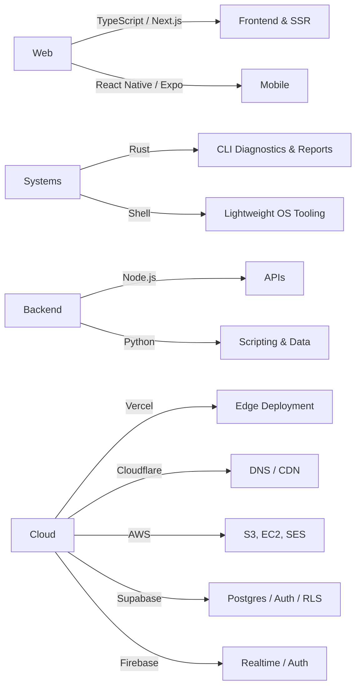

# Emmett Shaughnessy

**Full-Stack Developer | Technical Consultant | Builder**

---

## 🚀 Current Projects

<table>
<tr>
<td width="50%">

### [Qube TX](https://qubetx.com)
**Diagnostics Tooling & Web Studio**

A growing ecosystem of Rust CLI diagnostics tools, all now published to crates.io under canonical names: the TR-300 machine-report TUI (the `tr300` crate, with automated crates publish from main, CI version checks, and a chained installer that also writes the shell-profile alias and auto-run line), [`qube-network-diagnostics`](https://github.com/QubeTX/qube-network-diagnostics) (nd300 v3.0.x — hardened network-fix safety, evidence-driven fix-loop with per-action stabilization windows, OS-aware action registry, and a cargo-first / installer-fallback self-update chain that cleans up non-cargo installs on upgrade), and [`qube-system-diagnostics`](https://github.com/QubeTX/qube-system-diagnostics) (SD-300, shipped as the `tr300-tui` crate, with a stabilized updater and runner-compatible release metadata). Around them sit the web surfaces ([`QubeTX_Landing`](https://github.com/QubeTX/QubeTX_Landing), [`qube-machine-report-homepage`](https://github.com/QubeTX/qube-machine-report-homepage) with per-platform install one-liners and admin/sudo notes), the multi-provider [SpeedQX](https://github.com/QubeTX/speedtest) web app (bootstrap CIs, inverse-variance weighted aggregation, RFC 3550 jitter), and offline installer bundles ([`qube-reports-executables`](https://github.com/QubeTX/qube-reports-executables)). Also where most freelance/client work lives.

`Rust` `TypeScript` `Next.js` `CLI Tooling`

</td>
<td width="50%">

### [QorkMe](https://qork.me)
**URL Shortener**

Custom aliases, click analytics, and a clean redirect layer on a Next.js + Supabase stack. Hardened Supabase RLS (INSERT policy on clicks, `SECURITY DEFINER` increment, owner-only UPDATE/DELETE, revoked TRUNCATE from anon/authenticated), bounded the URL redirect cache, optimized AdminLinksTable maxClicks, consolidated to a Makira-only typeface, and refreshed the admin dashboard.

`Next.js` `TypeScript` `Supabase` `Tailwind`

</td>
</tr>
<tr>
<td width="50%">

### shaughvOS
**Custom Diagnostics OS**

Lightweight Debian-based diagnostics OS with Shaughv branding. v1.20.0 line shipped install + startup validation, a focus-smoke shellcheck gate, and a release-newline check on top of the v1.19.x CLI-first boot, working desktop shortcuts, Tailscale + Tor Browser pre-installs, an `autologin` command decoupled from `desktop on/off`, and apt-mark fixes.

`Shell` `Linux` `Build Pipelines`

</td>
<td width="50%">

### [Dorsey 2026](https://github.com/QubeTX/dorsey_2026_BETA)
**Music Artist Site**

A full rebuild of a touring artist's site on Next.js 16 / React 19 / Tailwind v4, with shadcn/ui components and Framer Motion choreography. Pivoted from a custom Jazz-Bauhaus reinterpretation to a faithful recreation of the live leonleedorsey.com visual language — header/footer reworked, home / about / music / store / videos / contact and several press / gear pages rebuilt, mobile nav swapped to a full-screen white sheet, and Squarespace media imported locally to avoid hotlinking. Currently finishing secondary route parity and final QA.

`Next.js 16` `React 19` `Tailwind v4` `Framer Motion`

</td>
</tr>
<tr>
<td width="50%">

### Magic Pantry
**Cross-Platform Pantry App**

Full rebuild of the Magic Pantry app, freshly migrated off the prior Replit + Express + Drizzle + Modelfarm stack onto self-hosted Supabase (Postgres + Auth + RLS + Realtime) with Expo SDK 55 / React Native 0.83 / React 19.2 / React Navigation v7 / TanStack Query v5. AI features (item categorization on Claude Haiku 4.5, recipe generation on Sonnet 4.6, URL recipe import via Firecrawl v2 + Sonnet 4.6, plus a service-role `delete-account` for App Store compliance) run through edge functions; account self-service — forgot/reset/change password, change username, signup-confirmation flow with 60s-cooldown resend — is wired end-to-end via `magicpantry://` deep links for App Store launch. Phase H also tightened sharing: shared-list members can see the full collaborator roster, but non-owner projections drop emails entirely and `findUserByUsernameOrEmail` returns username + id only. RLS helpers live in a `private` schema, the `citext` extension was moved out of `public`, and usernames are `citext` for case-insensitive uniqueness.

`Expo` `React Native` `Supabase` `Anthropic`

</td>
<td width="50%">

### [Personal Site](https://emmettshaughnessy.com)
**Portfolio & Writing**

Professional showcase, project index, and technical writing on a Next.js stack with a Pretext-powered responsive text layer, Lenis-driven smooth scroll, Anime.js choreography, and a forced-dark themed `/works` route (custom WebKit scrollbar on desktop, wrap-on-mobile filter rail). Vercel Analytics in production; recent passes covered design-system docs, an explicit pre-push checklist in `CLAUDE.md`, and a Claude Code GitHub workflow with `pull-requests: write`.

`TypeScript` `Next.js` `Tailwind` `Vercel`

</td>
</tr>
</table>

### Also in the workshop
Web surfaces around the Qube TX ecosystem ([`QubeTX_Landing`](https://github.com/QubeTX/QubeTX_Landing), [`qube-machine-report-homepage`](https://github.com/QubeTX/qube-machine-report-homepage), [`qube-reports-executables`](https://github.com/QubeTX/qube-reports-executables) for offline installers), the [SpeedQX](https://github.com/QubeTX/speedtest) web speed-test app and its parallel Expo/React Native port (v2.0 technician-grade accuracy overhaul, network metadata, jitter breakdown, bootstrap CI, inverse-variance weighting), `shaughv_vintage` (vintage-leaning personal portfolio with a Pretext-powered responsive text layer and a consolidated a11y pass), a print-tuned [`resume-2026`](https://resume.emmetts.dev) on Makira/Personal-Vogue that auto-deploys via GitHub Pages, [Time](https://github.com/RealEmmettS/time) (atomic-clock alternative to time.gov with Marzullo-uncertainty-based watch score), Remotion-based programmatic video experiments, MDX docs sites, and a rotating cast of small utilities (timer, qrgen, csv tools, countdown apps, movie list).

## 💻 Tech Stack

### Languages

### Frameworks & Libraries

### Cloud & Infrastructure

### Where my focus is right now
- 🥫 **Magic Pantry** – just landed the Replit → Supabase migration and Phase H: account self-service (forgot / reset / change password, change username, signup-confirmation flow with resend, `magicpantry://` deep links wired end-to-end) plus a sharing-hardening pass that scopes shared-list member projections to usernames-only and keeps emails out of the user-lookup API. Postgres with private-schema RLS helpers, `citext` extension moved out of `public`, Realtime, and Anthropic + Firecrawl edge functions for categorization / recipe generation / URL recipe import / account deletion
- 🦀 **Rust diagnostics tooling** – shipping the v3.x lines across all three crates: the TR-300 `tr300` crate (canonical machine-report TUI with a chained installer that writes the shell-profile alias and auto-run line), `qube-network-diagnostics` (nd300 v3.0.x — hardened network-fix safety, cleanup of non-cargo installs on upgrade), and `qube-system-diagnostics` (SD-300 via the `tr300-tui` crate with stabilized updater + runner-compatible release metadata) — all on an automated crates publish pipeline with CI version checks and a cargo-first / installer-fallback self-update chain
- 🐧 **shaughvOS** – Debian-based diagnostics OS, on the v1.20.0 line with install/startup validation, a focus-smoke shellcheck gate, CLI-first boot, working desktop shortcuts, Tailscale + Tor Browser pre-installs, and an `autologin` command decoupled from `desktop on/off`
- 🎵 **Dorsey 2026** – touring artist's site rebuild on Next.js 16 / React 19 / Tailwind v4; finishing secondary route parity and final QA on the leonleedorsey.com port with imported Squarespace media
- 🌐 **Modern web stacks** – Next.js 16 / React 19 / Tailwind v4 / shadcn/ui builds for client sites and Qube TX surfaces (refreshed `qube-machine-report-homepage` with chained one-liner installers and per-platform admin/sudo notes), deployed on Vercel
- 🔗 **Full-stack product work** – QorkMe on Next.js + Supabase with hardened RLS, bounded redirect cache, click analytics, and an admin dashboard
- 📱 **Cross-platform mobile** – Expo / React Native across Magic Pantry and the SpeedQX port carrying the v2.0 technician-grade accuracy overhaul (bootstrap CIs, inverse-variance weighting, AIM scores, byte-weighted progress) from the web app onto iPhone/iPad
- 🤖 **AI-assisted workflows** – pairing Claude / Codex agents into real product development; release pipelines moved from foreground `gh run watch` to non-blocking Monitor poll-loops, with `gh --jq` keeping the diff portable across machines without local jq
- 🔧 **Technical consulting** – pragmatic, end-to-end solutions for client work through Qube TX

---

**Building reliable, maintainable solutions that solve real problems.**

