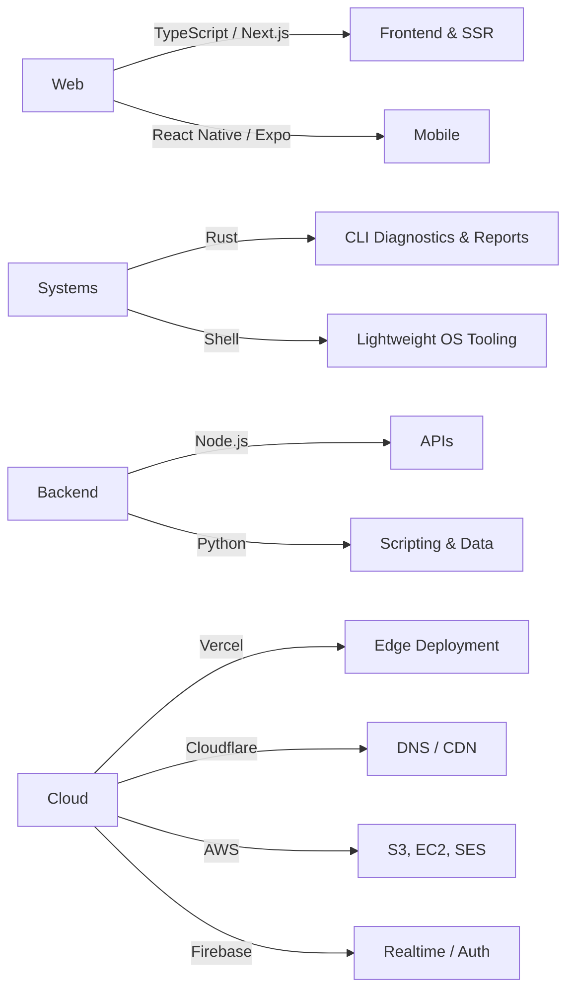

# Emmett Shaughnessy

**Full-Stack Developer | Technical Consultant | Builder**

---

## 🚀 Current Projects

<table>
<tr>
<td width="50%">

### [Qube TX](https://qubetx.com)
**Diagnostics Tooling & Web Studio**

A growing ecosystem of Rust-based CLI diagnostics tools (TR-200 / TR-300 machine reports, network and system diagnostics) plus the web surfaces and installer bundles around them. Also where most freelance/client work lives.

`Rust` `TypeScript` `Next.js` `CLI Tooling`

</td>
<td width="50%">

### [QorkMe](https://qork.me)
**URL Shortener**

Custom aliases, analytics, and a clean redirect layer. Currently being rebuilt on a TypeScript stack.

`TypeScript` `Full-Stack` `API Design`

</td>
</tr>
<tr>
<td width="50%">

### [Time](https://github.com/RealEmmettS/time)
**Atomic Clock Web App**

A nicer-looking alternative to time.gov — accurate, fast, and visually pleasant.

`JavaScript` `Web` `UX`

</td>
<td width="50%">

### [Personal Site](https://emmettshaughnessy.com)
**Portfolio & Writing**

Professional showcase, project index, and technical writing. Mid-rebuild on a fresh TypeScript stack.

`TypeScript` `Next.js` `Vercel`

</td>
</tr>
</table>

### Also in the workshop
Rust system tooling under the `qube-*` umbrella, an Expo/React Native speedtest app, a Shell-based diagnostics OS (`shaughvOS`), Remotion-based programmatic video experiments, MDX docs sites, and a rotating cast of small utilities (timer, qrgen, csv tools, countdown apps).

## 💻 Tech Stack

### Languages

### Frameworks & Libraries

### Cloud & Infrastructure

### Where my focus is right now
- 🦀 **Rust diagnostics tooling** – CLI machine reports, network and system diagnostics under the Qube TX umbrella
- 🌐 **Modern web stacks** – TypeScript + Next.js on Vercel for landing pages, internal tools, and product sites
- 📱 **Cross-platform mobile** – Expo / React Native experiments (speedtest, utilities)
- 🤖 **AI-assisted workflows** – pairing Claude / Codex agents into real product development
- 🔧 **Technical consulting** – pragmatic, end-to-end solutions for client work through Qube TX

---

**Building reliable, maintainable solutions that solve real problems.**

