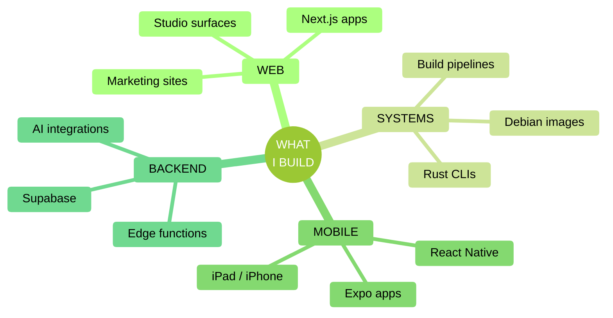

<!-- ====================================================================== -->
<!--  EMMETT SHAUGHNESSY · GITHUB PROFILE                                   -->
<!--                                                                        -->
<!--  Hand-built within the limits of GitHub's markdown sanitizer.          -->
<!--  No JavaScript, no CSS, no inline SVG, no GitHub Actions.              -->
<!--  Every dynamic element is GFM, a sanitizer-safe HTML tag, or a         -->
<!--  parameterized image URL rendered live on every page load.             -->
<!--                                                                        -->
<!--  Scroll to the COLOPHON at the bottom for the full catalogue of        -->
<!--  techniques used in this file.                                         -->
<!-- ====================================================================== -->

<picture>
  <source media="(prefers-color-scheme: dark)" srcset="https://capsule-render.vercel.app/api?type=waving&color=204F20&height=200&section=header&text=EMMETT%20SHAUGHNESSY&fontColor=F5E0C5&fontSize=52&fontAlignY=38&desc=DIGITAL%20CRAFTSMAN&descSize=16&descAlignY=58&descAlign=50&animation=fadeIn">
  
</picture>

<picture>
  <source media="(prefers-color-scheme: dark)" srcset="https://readme-typing-svg.demolab.com?font=Fira+Code&weight=600&size=20&duration=2400&pause=1200&color=F5E0C5&center=true&vCenter=true&width=640&lines=full-stack+developer+%C2%B7+rust+%2B+typescript;founder%2C+qube+tx+%C2%B7+diagnostics+%26+web+studio;building+magic+pantry%2C+dorsey+2026%2C+shaughv+os;shipping+reliable+systems+since+2017">
  
</picture>

 

 

I build full-stack products, Rust diagnostics, and the systems that ship them. Currently a workshop of Qube TX, Magic Pantry, Dorsey 2026, and the SHAUGHV brand system.

<kbd> Jump to </kbd>

&nbsp;

[`NOW`](#now) &nbsp;&middot;&nbsp; [`CURRENT WORK`](#current-work) &nbsp;&middot;&nbsp; [`STACK`](#stack) &nbsp;&middot;&nbsp; [`NUMBERS`](#numbers) &nbsp;&middot;&nbsp; [`COLOPHON`](#colophon)

---

## NOW

> [!NOTE]
> **MAY 2026, actively shipping**
>
> &middot; **Day-job, editorial PDF redesign + chat persona lock.** Late-May sprint lifting an internal monthly-reporting tool from functional to beta-ready: a typeset PDF cover (custom-typeface wordmark via CSS `mask-image` over an SVG + text fallback, photo-frame treatment, 4-photo cap, per-section page-break tuning), a paired editor header with an inline calendar SVG + a data-freshness pill, and a backend resilience pass on a flaky upstream image fetch (retry + exponential backoff against transient outages).
>
> **Underneath:** `Regenerate Report` from fresh data with a two-stage inline confirm, embedded-chat audience-role lock with an admin-verb regression guard, questionnaire answers wired into the LLM-synthesized narrative, and a cleared-photo-selection bug fixed symmetrically on the server-side PDF and the client draft preview.
>
> **Stack:** Python + FastAPI, React 19 + TypeScript + Vite, hand-rolled CSS, Azure Container Apps + Static Web Apps with named-revision deploys per merge.
>
> &middot; **Magic Pantry, 2.0.x close-out.** Offline-queued store actions land on `magicPantry_2026`: a `useStoreSyncStatus` hook + `offline-queued-items` test wrap `addStoreItem` / `updateStoreItem` / `removeStoreItem`, queue mutations on disconnect, and replay cleanly on reconnect. Sync state surfaces in `StoreDetailScreen` / `StoreListsScreen` / `ListItem` with theme tokens for offline / syncing / synced.
>
> **Release path locked:** `eas.json` pinned to a `production` environment carrying `EXPO_PUBLIC_SUPABASE_URL` + `EXPO_PUBLIC_SUPABASE_PUBLISHABLE_KEY`, release verification gated behind `eas-cli env:list production --format short` + `npm run test:all`, and developer / agent guidance consolidated into `CLAUDE.md` / `AGENTS.md` / `README.md`.
>
> &middot; **shaughv-code v0.8.0, dual-runtime plugin surface.** The SHAUGHV plugin marketplace now ships a paired Codex plugin alongside the Claude Code surface: a skills-only `.codex-plugin/plugin.json`, a `.agents/plugins/marketplace.json` entry, and an `AGENTS.md` covering Codex install / update flows. The Claude marketplace continues to carry the full set (skills + MCPs + commands); the Codex manifest is intentionally skills-only so the SHAUGHV skill library installs cleanly on both agent runtimes.

---

## CURRENT WORK

<table>
<tr>
<td width="50%" valign="top">

### [Qube TX](https://qubetx.com)
**Diagnostics tooling & web studio**

`Rust` `TypeScript` `Next.js` `CLI`

A growing ecosystem of Rust CLI diagnostics tools published to crates.io under canonical names. Also where most freelance / client work lives.

**TR-300 v3.15.3** ([`qube-machine-report`](https://github.com/QubeTX/qube-machine-report), `tr300` crate) closes the May Opus 4.7 1M-context cross-platform audit. **F22:** WMI routed through a fresh worker thread so `COMLibrary::new()`'s `CoInitializeEx(COINIT_MULTITHREADED)` succeeds inside Tauri / Slint / winit hosts. **F20:** a `windows-installers.yml` pre-flight that probes cargo-dist's `dist-manifest.json` before building the six installer add-ons. **F17:** a `warn_if_report_already_defined` install-time heuristic against colliding `report` aliases.

Underneath, the v3.15.x hardening line: SHA256 verification of every downloaded MSI / EXE, atomic profile writes with a one-time backup, dual `powershell` + `pwsh` writes, the four-installer Windows distribution (Global / Corporate &times; MSI / EXE) dispatched via an `HKCU\Software\TR300\InstallSource` registry marker, and an in-repo `release` skill codifying the publish loop.

Around the CLIs: [`qube-network-diagnostics`](https://github.com/QubeTX/qube-network-diagnostics) (nd300 v3.0.x, hardened network-fix loop, cargo-first self-update), [`qube-system-diagnostics`](https://github.com/QubeTX/qube-system-diagnostics) (republished as `tr300-tui`), the multi-provider [SpeedQX](https://github.com/QubeTX/speedtest) web app, and the [`QubeTX_Landing`](https://github.com/QubeTX/QubeTX_Landing) + [`qube-machine-report-homepage`](https://github.com/QubeTX/qube-machine-report-homepage) marketing surfaces.

</td>
<td width="50%" valign="top">

### [QorkMe](https://qork.me)
**URL shortener**

`Next.js` `TypeScript` `Supabase` `Tailwind`

Custom aliases, click analytics, and a clean redirect layer on a Next.js + Supabase stack.

**May 2026 SHAUGHV vintage palette migration.** Recolored every light + dark design token (cream surfaces, sage as the single action color, olive body text, bamboo warm accent), added IBM Plex Mono in the `--font-mono` slot alongside Makira, swapped hardcoded terracotta tones to sage across `UrlShortener` / `MatrixDisplay` / `MatrixBackground` / `SecureAccessMatrix`, and stripped `AmbientDecor` plus the card 3D tilt. Internal card shimmer beam preserved.

**Earlier this year:** Supabase RLS hardened end-to-end (INSERT policy on clicks, `SECURITY DEFINER` increment, owner-only writes, revoked TRUNCATE from anon / authenticated), URL redirect cache bounded with FIFO eviction, an O(N)-fix on AdminLinksTable maxClicks, and a refreshed admin dashboard.

</td>
</tr>
<tr>
<td width="50%" valign="top">

### shaughvOS
**Custom diagnostics OS**

`Shell` `Linux` `Build Pipelines`

Lightweight Debian-based diagnostics OS with Shaughv branding.

The **v1.20.0 line** stabilized install + startup validation behind a focus-smoke shellcheck gate and a release-newline check. Sits on top of v1.19.x's CLI-first boot, `/usr/local/bin/` desktop shortcuts, Tailscale + Tor Browser pre-installs, an `autologin` command decoupled from `desktop on/off`, and apt-mark drift fixes.

The full ~400-tool IT + security toolset is scoped and queued behind the stability work.

</td>
<td width="50%" valign="top">

### [Dorsey 2026](https://github.com/QubeTX/dorsey_2026_BETA)
**Music artist site**

`Next.js 16` `React 19` `Tailwind v4` `Framer Motion`

A full rebuild of a touring artist's site on Next.js 16 / React 19 / Tailwind v4, with shadcn/ui components and Framer Motion choreography.

Pivoted from a custom Jazz-Bauhaus reinterpretation to a faithful recreation of the live leonleedorsey.com visual language: header / footer reworked, home / about / music / store / videos / contact + several press / gear pages rebuilt, mobile nav swapped to a full-screen white sheet, and Squarespace media imported locally to avoid hotlinking.

Site layout recreate + asset import landed early May; currently in a quiet polishing stretch before handoff.

</td>
</tr>
<tr>
<td width="50%" valign="top">

### Magic Pantry
**Cross-platform pantry app**

`Expo` `React Native` `Supabase` `Anthropic`

Full rebuild of the Magic Pantry app, lifted out of the prior Replit + Express + Drizzle + Modelfarm stack into `magicPantry_2026` on Supabase (Postgres + Auth + RLS + Realtime) with Expo SDK 55 / React Native 0.83 / React 19.2 / TanStack Query v5. AI features run through edge functions: Haiku 4.5 for item helpers, Sonnet 4.6 for generation / parsing, Firecrawl v2 for URL recipe import.

**Latest, offline queue.** A 776-line `useStoreSyncStatus` hook + `offline-queued-items` test wraps `addStoreItem` / `updateStoreItem` / `removeStoreItem`, queues mutations when the network drops, and replays them cleanly on reconnect. Sync state pulled into `StoreDetailScreen` / `StoreListsScreen` / `ListItem` with theme tokens for offline / syncing / synced.

**Underneath, 2.0 / 2.0.1 store-ready prep.** EAS project + account wired into `app.json` with `eas.json` pinned to a `production` environment carrying the public Supabase URL + publishable key, release verification gated behind `eas-cli env:list production --format short` + `npm run test:all`, Supabase magic-link sign-in via `magicpantry://` deep links, a Neon &rarr; Supabase migration runner with backups, a stability pass on the realtime sync hook + a 290-line `RecipesScreen` rewrite + `recipe-sharing` helpers, and an AI model policy in `AGENTS.md` locking item helpers to Haiku 4.5 and generation to Sonnet 4.6.

**Phases I-L.** Long-press + ActionSheet smart entry (`bulk-parse-items` / `generate-list`); debounced `PairingChips` row running `pair-suggestions` on keystroke; recipes table back with Library / Generate / Import + "What can I make?" pill running `recipes-from-list`; `find-substitute` returning "name -- note" with Replace / Add as new; `store_lists.sort_mode` (aisle grouped vs manual flat). Five new edge functions deployed; `tsc --noEmit` clean.

**Phase H, still underneath.** Account self-service (forgot / reset / change password, change username, signup confirmation via `magicpantry://` deep links). Sharing tightened so non-owner projections drop emails entirely; RLS helpers in a `private` schema; `citext`-keyed username uniqueness.

</td>
<td width="50%" valign="top">

### [Personal Site](https://emmettshaughnessy.com)
**Portfolio & writing**

`TypeScript` `Next.js` `Tailwind` `Vercel`

Professional showcase, project index, and technical writing on a Next.js stack with a Pretext-powered responsive text layer, Lenis-driven smooth scroll, and Anime.js choreography. The `/works` route is forced-dark with a filter rail that wraps instead of scrolling on narrow viewports.

Vercel Analytics in production; recent passes covered design-system docs, an explicit pre-push checklist in `CLAUDE.md`, and a Claude Code GitHub workflow with `pull-requests: write` so the bot can actually post its reviews.

</td>
</tr>
</table>

<strong>Also in the workshop,</strong> a dozen more repos &amp; surfaces

&nbsp;

**SHAUGHV brand system.** [`shaughv-cdn`](https://github.com/RealEmmettS/shaughv-cdn) is the Cloudflare R2 brand-asset CDN at [`cdn.shaughv.com`](https://cdn.shaughv.com), hosting 91 versioned assets: the SHAUGHV wordmark + favicon variants + figurines, the full Makira Sans-Serif and IBM Plex Mono font families, plus vanilla and React / Framer Motion brandmark drop-ins. Per-object Content-Type + Cache-Control set at upload, paired CHANGELOG / HUMAN_CHANGELOG contract, and an `/install-cloudflare-mcp` project-level Claude Code skill.

[`shaughv-code`](https://github.com/RealEmmettS/shaughv-code) is the SHAUGHV plugin marketplace at v0.8.0 after a six-release sprint: bundling `critical-thinking`, `openai-audio`, `pretext`, `perplexity-search`, `quiver-ai`, `shaughv-animated-brandmark`, `shaughv-design`, `/human-changelog`, `shaughv-cdn`, `naming-conventions`, and paired `gcs-storage` + `shaughv-gcs-storage`; two MCP server bundles (`@remotion/mcp` powering `/shaughv-code:create-video`, and `craft-docs` over Streamable HTTP + OAuth); plus a v0.8.0 dual-runtime split that ships a skills-only Codex plugin (`.codex-plugin/plugin.json` + `.agents/plugins/marketplace.json` + `AGENTS.md`) alongside the existing Claude Code surface so the same skill library installs on both runtimes.

[`shaughv_vintage`](https://github.com/RealEmmettS/shaughv_vintage) is the vintage-leaning personal portfolio refreshed onto the SHAUGHV vintage design system with Pretext-driven auto-fit headings, an `IntersectionObserver` scrollspy, and a project-level Claude Code automation pack (paired-changelog hook, Pretext `TEXT_REGISTRY` hook, `/changelog-pair` skill, motion-accessibility + design-system-guardian reviewer agents, MCP wiring for context7 + chrome-devtools).

**Video + media.** [`italy-trip-video`](https://github.com/RealEmmettS/italy-trip-video) is a new Remotion project: a 50th-birthday Italy trip slideshow at 1920&times;1080 @ 30fps, 270.96s runtime, 92 chronological images, `divineSong.mp3` audio, a `SubtitleOverlay` component with Makira and timed `lyricCaptions`, both `ItalyTripSlideshow` and `ItalyTripSlideshowSubtitled` compositions registered, and a Remotion &rarr; CapCut polish pipeline. Scaffolded by `/shaughv-code:create-video`.

**Web tools.** [`qrgen`](https://github.com/RealEmmettS/qrgen) is a QR-code generator + AI styling tool rebuilt as a SHAUGHV product surface: time-of-day dual-palette system, self-hosted Makira + IBM Plex Mono, asymmetric 12-col workspace grid, a `SegmentedControl` primitive with `framer-motion` `layoutId` active-pill slide, a boundary-walking QR outline tracer powering a 6-phase boot loader, and AI generation via Gemini 3.1 flash image preview.

[`realtime2_test`](https://github.com/RealEmmettS/realtime2_test) is an OpenAI Realtime API voice-agent prototype on a hybrid Vercel-functions + Express architecture: a `Cypher` persona auto-greet, paired mic / audio-output device selectors, an AudioContext-driven silence-detection diagnostic, and a per-route handler model that lets the same pure functions back both Express and Vercel deployments.

**Qube TX surfaces.** [`QubeTX_Landing`](https://github.com/QubeTX/QubeTX_Landing), [`qube-machine-report-homepage`](https://github.com/QubeTX/qube-machine-report-homepage), [`qube-reports-executables`](https://github.com/QubeTX/qube-reports-executables) (offline installers), the multi-provider [SpeedQX](https://github.com/QubeTX/speedtest) web app and its parallel Expo / React Native port carrying the v2.0 technician-grade accuracy overhaul (bootstrap CIs, inverse-variance weighting, RFC 3550 jitter, byte-weighted progress).

**Smaller surfaces.** A print-tuned [`resume-2026`](https://resume.emmetts.dev) on Makira / Personal-Vogue that auto-deploys via GitHub Pages, [Time](https://github.com/RealEmmettS/time) (atomic-clock alternative to time.gov with a Marzullo-uncertainty-based watch score), Remotion-based programmatic video experiments, MDX docs sites, and a rotating cast of small utilities (timer, csv tools, countdown apps, movie list).

---

## STACK

 

### 2026 release timeline

| Quarter | Month | Shipped |
|:---:|:---:|---|
| **Q1** | **Jan** | TR-300 v3.12, QorkMe RLS hardening |
|        | **Feb** | Magic Pantry, Supabase migration |
|        | **Mar** | shaughvOS v1.18, CLI-first boot |
| **Q2** | **Apr** | Magic Pantry Phase G, auth flows |
|        | **May** | **TR-300:** v3.14.x preflight chain, v3.15.0 / v3.15.1 four-installer Windows distribution, v3.15.2 cross-platform Opus 4.7 audit + SHA256 installer verification, v3.15.3 audit close (F17 / F20 / F22), May-27 security hardening triplet (updater + fast-mode GPU helpers + markdown auto-save).    **Magic Pantry:** Phase H + Phases I-L (smart entry, recipes library, substitutions, sort modes, 5 new edge functions), 2.0 / 2.0.1 store-ready prep (EAS production env requirement + release-verification checklist, magic-link sign-in, Neon &rarr; Supabase migration runner, AI model policy), offline queued store actions.    **SHAUGHV brand:** `shaughv-cdn` launch (91 assets to Cloudflare R2), `shaughv-code` v0.2.0 &rarr; v0.8.0 marketplace sprint capped by a dual-runtime Codex plugin surface, `italy-trip-video` Remotion 50th-birthday slideshow, `shaughv_vintage` refresh + project-level Claude Code automation.    **Web tools:** `qrgen` SHAUGHV product surface rebuild with time-of-day dual palette + QR outline tracer, `realtime2_test` OpenAI Realtime API prototype, QorkMe SHAUGHV vintage palette migration.    **Other:** shaughvOS v1.20, day-job sprint across internal monthly-reporting tool + scorecards dashboard + team tooling (Regenerate Report flow with versioned snapshots + undo + history + two-stage inline confirm, editorial PDF redesign with SVG-mask wordmark + photo-frame treatment + 4-photo cap + retry/backoff upstream image fetch, embedded-chat audience-role lock with admin-verb regression guard, 6-chart Visual Snapshot data-viz layer, internal task-queue MCP `update_task` multi-operator edit, internal Claude Code plugin distributing the team skill library, `mission-control-mcp` umbrella skill). |

 

### Languages

### Frameworks &amp; libraries

### Cloud &amp; infrastructure

<strong>More on what I'm building right now,</strong> full breakdown

&nbsp;

- **shaughv-cdn.** Cloudflare R2 brand-asset CDN at [`cdn.shaughv.com`](https://cdn.shaughv.com), 91 versioned assets in one push.
  - **Brand assets:** SHAUGHV wordmark (SVG + Green / Orange PNG), 4 favicon variants, 2 figurine SVGs + 10 webp variants.
  - **Fonts:** full Makira Sans-Serif family (6 weights &times; OTF / TTF / WOFF / WOFF2 + variable axis) and full IBM Plex Mono (7 weights &times; normal + italic).
  - **JS:** vanilla animated brandmark, vanilla loader, React / Framer Motion source port.
  - **Infra:** auto-generated Live URL map via `scripts/generate-url-table.sh`, paired CHANGELOG / HUMAN_CHANGELOG contract, `/install-cloudflare-mcp` project-level Claude Code skill that bootstraps the official Cloudflare MCP.

- **shaughv-code v0.2.0 &rarr; v0.8.0.** Six-release sprint on the SHAUGHV plugin marketplace.
  - **v0.3.0:** `@remotion/mcp` docs server bundled via `.mcp.json` + a `/shaughv-code:create-video` slash command that scaffolds a Remotion Recorder project.
  - **v0.4.0:** `shaughv-cdn` consumer skill (URL conventions, font preload patterns, cache contract, decision matrix).
  - **v0.5.0 / v0.5.1:** new `naming-conventions` skill, `npx skills` install path, split README with copy-paste Update block separate from the maintainer workflow.
  - **v0.6.0:** paired `gcs-storage` + `shaughv-gcs-storage` skills, the latter pre-wired to `gs://shaughv` with bucket facts baked in (uniform IAM, public reads, 7-day soft delete, versioning on).
  - **v0.7.0:** `craft-docs` MCP server bundle over Streamable HTTP + OAuth so the agent can read / write a Craft Doc directly.
  - **v0.8.0:** dual-runtime plugin surface; paired skills-only `.codex-plugin/plugin.json` + `.agents/plugins/marketplace.json` entry + `AGENTS.md` covering Codex install / update flows, alongside the unchanged Claude Code marketplace carrying the full skills + MCPs + commands set.

- **italy-trip-video.** Remotion 50th-birthday Italy trip slideshow: 1920&times;1080 @ 30fps, 270.96s runtime, 92 chronological images, `divineSong.mp3` audio.
  - `SubtitleOverlay` component loads Makira and renders timed `lyricCaptions`; both `ItalyTripSlideshow` and `ItalyTripSlideshowSubtitled` compositions registered.
  - `AGENTS.md` codifies the Remotion slideshow spec end-to-end (hard constraints, composition design, pipeline, asset conventions, iteration guardrails).
  - Pipeline: Remotion &rarr; CapCut for the final polish pass. Scaffolded by `/shaughv-code:create-video` the same week.

- **Magic Pantry, offline queued store actions.** 776-line addition on `magicPantry_2026` (12 files).
  - Wraps `addStoreItem` / `updateStoreItem` / `removeStoreItem` in a new `useStoreSyncStatus` hook + `offline-queued-items` test surface.
  - App-level wiring through `query-client.ts`, `api.ts`, `AuthContext.tsx`; sync state surfaced in `StoreDetailScreen`, `StoreListsScreen`, `ListItem`; theme tokens extended for offline / syncing / synced.
  - Net effect: keep adding to a list on the subway with no signal; the queue drains against the live Supabase store on reconnect.

- **Magic Pantry 2.0 / 2.0.1 store-ready prep.** App Store submission window.
  - **EAS wired** into `app.json` (`extra.eas.projectId` + `owner = "realemmetts"`) so cloud builds + store submissions can run; `eas.json` pinned to a `production` environment carrying `EXPO_PUBLIC_SUPABASE_URL` + `EXPO_PUBLIC_SUPABASE_PUBLISHABLE_KEY`, with release verification gated behind `eas-cli env:list production --format short` + `npm run test:all`.
  - **Supabase magic-link sign-in** via passwordless `signInWithOtp` round-trip through `magicpantry://` deep links + a new `auth-email-actions` helper with unit coverage.
  - **Neon &rarr; Supabase migration runner** with backups so the prior Drizzle / Neon export imports cleanly.
  - **2.0.1 stability pass:** 712-line refactor on the realtime sync hook, `recipe-sharing` helper module + tests, 290-line `RecipesScreen` rewrite.
  - **AI model policy** in `AGENTS.md`: Haiku 4.5 reserved for `categorize-item` / `pair-suggestions` / `find-substitute`; Sonnet 4.6 mandated for `bulk-parse-items` / `generate-list` / `generate-recipe` / `import-recipe` / `recipes-from-list`. Two Sonnet-backed edge functions upgraded in lockstep.
  - **`.agents/demo-test-command.md`** codifies the PowerShell-backgrounded `npx expo start` workflow for live Expo Go demos.

- **Magic Pantry Phases I-L.** Smart entry, recipes library, substitutions, sort modes.
  - **Smart entry:** long-press + ActionSheet (`Paste a list` &rarr; `bulk-parse-items` + editable confirmation; `Generate from prompt` &rarr; `generate-list`). Debounced `PairingChips` row runs `pair-suggestions` on every keystroke.
  - **Recipes:** migration 0009 adds the recipes table (jsonb arrays + `text[]` dietary tags + RLS own-only); Library / Generate / Import segmented control + "What can I make?" pill running `recipes-from-list`; server-side dietary-tag inference.
  - **Substitutions:** long-press item row &rarr; ActionSheet (Change category / Find substitute / Delete); `find-substitute` returns "name -- note" with Replace / Add as new.
  - **Sort modes:** migrations 0010 + 0011 add `store_lists.sort_mode` (aisle grouped vs manual flat), owner-only toggle in `StoreSettings`.
  - Five new edge functions deployed; three updated; `tsc --noEmit` clean.

- **qrgen, SHAUGHV product-surface rebuild.** QR-code generator + AI styling tool onto the SHAUGHV dual-palette system.
  - **Palette:** vintage cream by default, brutalist near-black + brand orange between 20:30 and 07:00 local, set client-side by `public/boot.js` via `beforeInteractive` so `data-theme` is correct on the very first frame.
  - **Type + tokens:** self-hosted Makira + IBM Plex Mono, semantic typography classes (`sv-display`, `sv-h1`..`sv-h4`, `sv-eyebrow`, `sv-label`, `sv-nav`, `sv-mono`, `sv-slash`), Tailwind v4 bridge via `@theme inline`.
  - **Workspace:** 12-col asymmetric grid on `lg+`, mobile collapses to a single ordered flex stack; new `SegmentedControl` primitive with `framer-motion` `layoutId` active-pill slide.
  - **Boot loader:** boundary-walking QR outline tracer in `src/lib/qr-outline.ts` (rebuilds the matrix via `qrcode-generator`, emits boundary edges, stitches via perimeter walking) powering a 6-phase boot loop.
  - **AI generation:** Gemini 3.1 flash image preview with `responseModalities: ["TEXT", "IMAGE"]` + a ThinkingLevel-high prompt enhancer.

- **QorkMe SHAUGHV vintage palette migration.** Recolored every design token (cream / sage / olive / bamboo), added IBM Plex Mono in the `--font-mono` slot, swapped hardcoded terracotta to sage across `UrlShortener` / `MatrixDisplay` / `MatrixBackground` / `SecureAccessMatrix`, deleted `AmbientDecor` + the card 3D tilt wrapper. Internal card shimmer beam preserved.

- **TR-300 May-27 security hardening triplet.** Three Codex-authored open PRs on [`qube-machine-report`](https://github.com/QubeTX/qube-machine-report).
  - **PR #1, Windows updater temp-file handling:** new `unique_update_temp_path()` (VERSION + nanos timestamp + PID + sequence); `download_to_file` swaps `File::create` for `OpenOptions::create_new(true)` so a pre-planted `%TEMP%` symlink can't redirect or truncate the download.
  - **PR #2, fast-mode GPU helper path resolution:** absolute system paths for `reg.exe` / `lspci` / `ioreg` / `sysctl` (Windows `C:\Windows\System32\reg.exe`; Linux walks `/usr/bin/lspci` &rarr; `/bin/lspci` &rarr; `/usr/sbin/lspci` &rarr; `/sbin/lspci`; macOS `/usr/sbin/ioreg` + `/usr/sbin/sysctl`).
  - **PR #3, markdown auto-save against privileged clobber:** skip when `is_elevated`; `OpenOptions::create_new(true)` + `write_all` so symlinks aren't followed and existing files aren't truncated; PID + high-resolution timestamp in the generated filename.
  - Each PR runs `cargo fmt` / `clippy --all-targets --workspace -- -D warnings` / `cargo test --workspace --all-targets` clean.

- **TR-300 cross-platform audit, fully closed at v3.15.3.** Every May Opus 4.7 1M-context audit finding deferred at v3.15.2 now landed.
  - **F22:** WMI block routed through a fresh worker thread so `COMLibrary::new()`'s `CoInitializeEx(COINIT_MULTITHREADED)` succeeds inside Tauri / Slint / winit hosts. 10s `WMI_BATCH_TIMEOUT`; cheap main-thread probes kept ahead of the worker.
  - **F20:** pre-flight asset check in `windows-installers.yml` probing cargo-dist's `dist-manifest.json` + the Global MSI via `gh release view --json assets`; fails fast on torn upstream releases with an actionable `workflow_dispatch` re-fire.
  - **F17:** read-only `warn_if_report_already_defined` heuristic scanning six rc files + PATH for a colliding `report` alias; no subprocess so a noisy rc file can't trigger side effects.
  - **Under it (v3.15.2):** SHA256 verification of every downloaded MSI / EXE against the cargo-dist sidecar; atomic profile writes via `install::atomic_write` + one-time `.tr300-backup`; `install::check_marker_balance` refusing to mutate a hand-mutilated profile; dual `powershell` + `pwsh` writes; an Inno `EnvRemovePath` off-by-one fix; `Drop`-guarded console code page on Windows.
  - Vendored Anthropic-distributed `.claude/skills` (brainstorming / critical-thinking / architecture / system-design) under `ATTRIBUTION.md`. v3.0.0 &rarr; v3.15.1 HUMAN_CHANGELOG backfilled.

- **shaughv_vintage + repo-travelling Claude Code automation.** Vintage-leaning portfolio refresh + a removable, in-repo automation pack.
  - **Visual:** Pretext-driven auto-fit display headings, hierarchical two-line mobile hero, kit figurine revealed across every breakpoint, dimmed hero hairline, `min-h-[100dvh]` extended to every viewport.
  - **A11y:** `IntersectionObserver` scrollspy that paints the active section sage and stamps `aria-current="true"`, logo smooth-scrolls to top instead of mutating `#hero` in the URL.
  - **Automation pack:** `.claude/hooks/check-changelog-pair.mjs` (paired changelog drift warning), `.claude/hooks/check-pretext-registry.mjs` (PostToolUse block on `TEXT_REGISTRY` drift), `.claude/skills/changelog-pair`, `.claude/agents/motion-accessibility-reviewer`, `.claude/agents/design-system-guardian`, `.mcp.json` wiring context7 + chrome-devtools.

- **realtime2_test.** OpenAI Realtime API voice-agent prototype on Vercel.
  - **Architecture:** transport-agnostic pure functions in `src/shared/realtimeApi.ts` returning `ApiResult<T>`, thin Express handlers for local dev, per-route Vercel function wrappers in `api/**`.
  - **UX:** Cypher persona auto-greets on data-channel open; transcript is a Lenis-smoothed fluid color-only stream with a 120-entry diagnostic event buffer.
  - **Device gating:** Start Session blocked until mic + audio-output device picks; required selectors painted sage with progressive hint copy; AudioContext silence-detection diagnostic.

- **Day-job, internal-tools cycle.** Python / FastAPI + TypeScript + React + SQL + Azure Container Apps.
  - **Monthly-reporting tool:** Regenerate Report flow (versioned `report_narrative_snapshots`, 30s undo, restore-to-version history, chat-aware re-synthesis) with a two-stage inline confirm; embedded-chat persona lock with admin-verb regression guard; questionnaire answers wired into the LLM-synthesized narrative; editorial PDF redesign (custom-typeface wordmark via CSS `mask-image` over an SVG + text fallback, photo-frame treatment, 4-photo cap UI, per-section page-break tuning); editor header redesign (inline calendar SVG + data-freshness pill, replacing a stacked layout); backend resilience pass on a flaky upstream image fetch (retry + exponential backoff against transient outages); cleared-photo-selection bug fixed symmetrically on the server-side PDF and the client draft preview; smaller polish (`Clear Chat` confirm-to-modal swap, day-of-week on the `Last report` label, chat panel height growth fix on long conversations, empty-state suppression when a section's footer slot has content); date-answer validation tightened; `questionnaire_seed_failed` audit event for KQL observability.
  - **Scorecards dashboard:** 6-chart Visual Snapshot section (contingency gauge, billed donut, 3-row budget-vs-actual bars, GM% sparkline, monthly-cost performance bar, cumulative-cash area trend) backed by a new `GET /api/project-scorecard-history`; allowlist-scoped office picker via a new `useM1Branches` wrapper; per-route handle-scoped office / status filters; project-detail header re-layout.
  - **Task-queue MCP server:** `update_task` extended with author / assignee operator-id edit fields (operator-table validation + activity-log entries); stale-read race on the pinned-task reorder UI patched; both shipped through one PR with a healthy multi-replica rollout.
  - **Team tooling distribution:** an internal Claude Code plugin packaging the full team skill library for one-command install on teammates' machines (discoverable via the standard plugin listing, clean-reinstall validated), plus a `mission-control-mcp` umbrella skill that bundles the task-queue MCP toolkit and the orchestrator planning ritual.
  - Also drafted a reusable `security-checks` Claude Code skill covering an Azure stack (subscriptions / RBAC / Key Vault / SQL roles) and GitHub (branch protection / CODEOWNERS / secret scanning).

- **nd300 + SD-300.** `qube-network-diagnostics` v3.0.x hardened the network-fix loop with per-action stabilization windows and a cargo-first / installer-fallback self-update chain. `qube-system-diagnostics` republished as the canonical `tr300-tui` crate.

- **shaughvOS.** Debian-based diagnostics OS on the v1.20.0 line: install / startup validation, focus-smoke shellcheck gate, release-newline check, CLI-first boot, desktop shortcuts via `/usr/local/bin/` symlinks, Tailscale + Tor Browser pre-installs, `autologin` decoupled from `desktop on/off`.

- **Dorsey 2026.** Touring artist's site rebuild on Next.js 16 / React 19 / Tailwind v4. leonleedorsey.com layout recreate + Squarespace asset import landed early May; now in a quiet polishing stretch before handoff.

- **AI-assisted workflows.** Pairing Claude / Codex agents into real product development across Anthropic + OpenAI surfaces; the same week's 6-chart Visual Snapshot ship on the day-job scorecards dashboard was delivered with the coding agent on a feature branch off a daily work-branch, squash-merged into the daily branch behind a normal PR review. Release pipelines moved from foreground `gh run watch` to non-blocking Monitor poll-loops.

- **Technical consulting.** Pragmatic, end-to-end solutions for client work through Qube TX.

---

## NUMBERS

 

<table align="center" width="100%">
<tr>
<td width="50%" align="center">

<picture>
  <source media="(prefers-color-scheme: dark)" srcset="https://github-readme-streak-stats.demolab.com?user=RealEmmettS&background=204F20&stroke=F5E0C5&ring=F5E0C5&fire=F5E0C5&currStreakNum=F5E0C5&sideNums=F5E0C5&currStreakLabel=F5E0C5&sideLabels=F5E0C5&dates=F5E0C5">
  
</picture>

</td>
<td width="50%" align="center">

<picture>
  <source media="(prefers-color-scheme: dark)" srcset="https://github-readme-stats.vercel.app/api/top-langs/?username=RealEmmettS&layout=compact&langs_count=10&hide=html,css&size_weight=0.5&count_weight=0.5&bg_color=204F20&title_color=F5E0C5&text_color=F5E0C5&border_color=F5E0C5">
  
</picture>

</td>
</tr>
</table>

<picture>
  <source media="(prefers-color-scheme: dark)" srcset="https://github-readme-activity-graph.vercel.app/graph?username=RealEmmettS&bg_color=204F20&color=F5E0C5&line=F5E0C5&point=F5E0C5&area=true&area_color=F5E0C5&hide_border=false&border_color=F5E0C5&custom_title=COMMITS+OVER+52+WEEKS">
  
</picture>

---

## COLOPHON

<strong>What this README actually does,</strong> the full catalogue of techniques

&nbsp;

This profile is a working demo of what GitHub's markdown renderer and HTML sanitizer currently allow inside a profile README. Every technique here is plain markdown, sanitizer-safe HTML, or a parameterized image URL: no GitHub Actions, no JavaScript, no CSS, no inline SVG, no Camo-bypassing tricks.

| Technique | Where it's used here |
|---|---|
| `<picture>` + `prefers-color-scheme` | Hero banner, typing SVG, streak card, top-langs card, activity graph, footer banner |
| GFM alert (`> [!NOTE]`) | The `NOW` block |
| `
` / `
` (interactive) | TOC, workshop list, focus deep-dive, this colophon |
| Mermaid `mindmap` (themed `forest`) | `STACK` diagram |
| Markdown table (bold-cell headers) | 2026 release timeline |
| Heading auto-anchors | TOC jump links (`#now`, `#current-work`, etc.) |
| `<kbd>` semantic tag | TOC summary chip |
| Camo-proxied animated SVGs | Capsule banner (SMIL `fadeIn`), typing SVG (CSS animation) |
| Live dynamic shields | Public repos and public gists pulled from the GitHub API via `dynamic/json` queries; followers, last-push, stars, total stars, following pulled from shields' GitHub endpoints |
| Live widget cards | `komarev` views, github-readme-streak-stats, top-langs (size + count blended for recency), activity-graph |
| Custom-themed shields | Every badge tuned to a two-color palette: forest `#204F20`, cream `#F5E0C5` |
| `<table>` for grid layout | 2&times;3 projects, paired streak + languages |
| HTML comments | Source-only annotations at the top of this file |
| HTML entities (`&middot;`, `&nbsp;`, `&amp;`) | Body copy and inline separators |

**Things the GitHub sanitizer blocks, that this README respects:** inline `<svg>`, `<script>`, `<style>`, `<iframe>`, `<form>`, `<button>`, `<video>`, `<audio>`, `class=`, `style=`, `target=_blank`. Everything is either pre-rendered server-side into an SVG and proxied through Camo, or written with one of the &sim;14 tags on the sanitizer's allowlist.

**Deferred to a future automation pass** (each needs a GitHub Action this repo doesn't yet have): the Platane/snk contribution-snake animation, lowlighter/metrics SVG dashboard, yoshi389111/github-profile-3d-contrib isometric grid, and a WakaTime card.

Sources for the renderer constraints: [html-pipeline](https://github.com/gjtorikian/html-pipeline) &middot; [GitHub blog on dark/light images](https://github.blog/developer-skills/github/how-to-make-your-images-in-markdown-on-github-adjust-for-dark-mode-and-light-mode/) &middot; [GitHub Mermaid docs](https://docs.github.com/en/get-started/writing-on-github/working-with-advanced-formatting/creating-diagrams).

---

<picture>
  <source media="(prefers-color-scheme: dark)" srcset="https://capsule-render.vercel.app/api?type=waving&color=204F20&height=140&section=footer&text=BUILDING+RELIABLE+SYSTEMS&fontColor=F5E0C5&fontSize=22&fontAlignY=70&desc=HEY%40EMMETTS.DEV+%C2%B7+EMMETTSHAUGHNESSY.COM&descSize=12&descAlignY=88&descAlign=50">
  
</picture>
