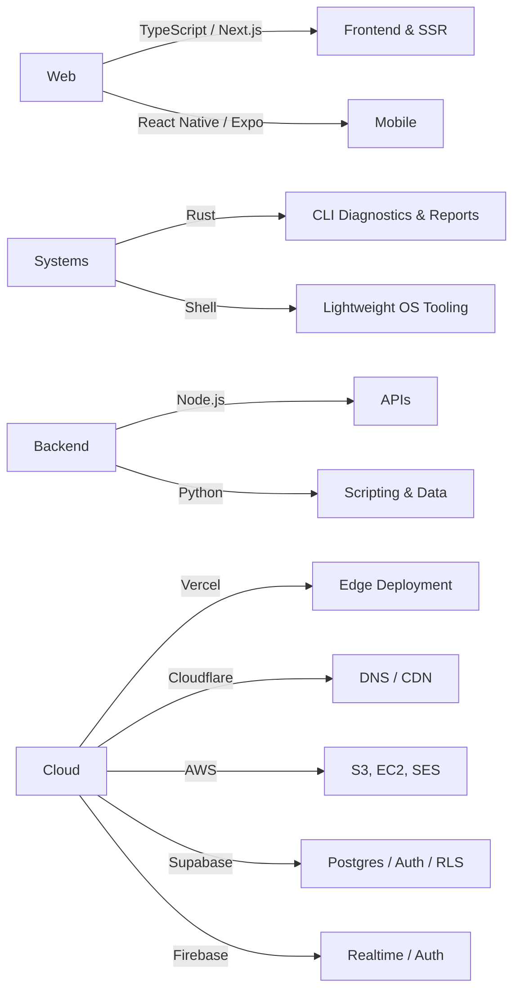

# Emmett Shaughnessy

**Full-Stack Developer | Technical Consultant | Builder**

---

## 🚀 Current Projects

<table>
<tr>
<td width="50%">

### [Qube TX](https://qubetx.com)
**Diagnostics Tooling & Web Studio**

A growing ecosystem of Rust CLI diagnostics tools — `qube-machine-report` (TR-200 / TR-300, now at v3.13.x with Windows polish and VPN-aware reporting), `qube-network-diagnostics` (v3.x, recently overhauled with subcommand syntax and a diagnostic-driven triage loop), and `qube-system-diagnostics` — plus the web surfaces, landing pages, and installer bundles around them. Also where most freelance/client work lives.

`Rust` `TypeScript` `Next.js` `CLI Tooling`

</td>
<td width="50%">

### [QorkMe](https://qork.me)
**URL Shortener**

Custom aliases, click analytics, and a clean redirect layer, now running on a Next.js + Supabase stack with hardened RLS, an admin dashboard, and a Makira-typeset UI.

`Next.js` `TypeScript` `Supabase` `Tailwind`

</td>
</tr>
<tr>
<td width="50%">

### [shaughvOS](https://github.com/RealEmmettS/shaughvOS)
**Custom Diagnostics OS**

Lightweight Debian-based diagnostics OS with Shaughv branding. Currently on the v1.20.x line — CLI-first boot, install/startup stabilization, and a shellcheck-gated CI pipeline.

`Shell` `Linux` `Build Pipelines`

</td>
<td width="50%">

### Dorsey 2026
**Music Artist Site**

A full rebuild of a touring artist's site on Next.js 16 / React 19 / Tailwind v4, with shadcn/ui components, Framer Motion choreography, Lenis smooth scroll, and a custom Jazz-Bauhaus design system.

`Next.js 16` `React 19` `Tailwind v4` `Framer Motion`

</td>
</tr>
<tr>
<td width="50%">

### [Time](https://github.com/RealEmmettS/time)
**Atomic Clock Web App**

A nicer-looking alternative to time.gov — accurate, fast, and visually pleasant.

`JavaScript` `Web` `UX`

</td>
<td width="50%">

### [Personal Site](https://emmettshaughnessy.com)
**Portfolio & Writing**

Professional showcase, project index, and technical writing. Mid-rebuild on a fresh TypeScript stack.

`TypeScript` `Next.js` `Vercel`

</td>
</tr>
</table>

### Also in the workshop
Web surfaces around the Qube TX ecosystem (`QubeTX_Landing`, `qube-machine-report-homepage`, `qube-reports-executables` for offline installers), an Expo/React Native speedtest app, Remotion-based programmatic video experiments, MDX docs sites, and a rotating cast of small utilities (timer, qrgen, csv tools, countdown apps).

## 💻 Tech Stack

### Languages

### Frameworks & Libraries

### Cloud & Infrastructure

### Where my focus is right now
- 🦀 **Rust diagnostics tooling** – shipping the v3.x lines of `qube-machine-report` and `qube-network-diagnostics` (subcommand syntax, diagnostic-driven triage loops, Windows polish, self-update flow)
- 🐧 **shaughvOS** – Debian-based diagnostics OS, currently stabilizing the v1.20.x install / boot path with shellcheck-gated CI
- 🌐 **Modern web stacks** – Next.js 16 / React 19 / Tailwind v4 / shadcn/ui builds for client sites and Qube TX surfaces, deployed on Vercel
- 🔗 **Full-stack product work** – QorkMe on Next.js + Supabase with hardened RLS, click analytics, and an admin dashboard
- 📱 **Cross-platform mobile** – Expo / React Native experiments (speedtest, utilities)
- 🤖 **AI-assisted workflows** – pairing Claude / Codex agents into real product development
- 🔧 **Technical consulting** – pragmatic, end-to-end solutions for client work through Qube TX

---

**Building reliable, maintainable solutions that solve real problems.**

