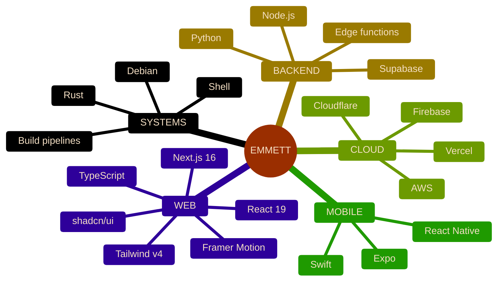
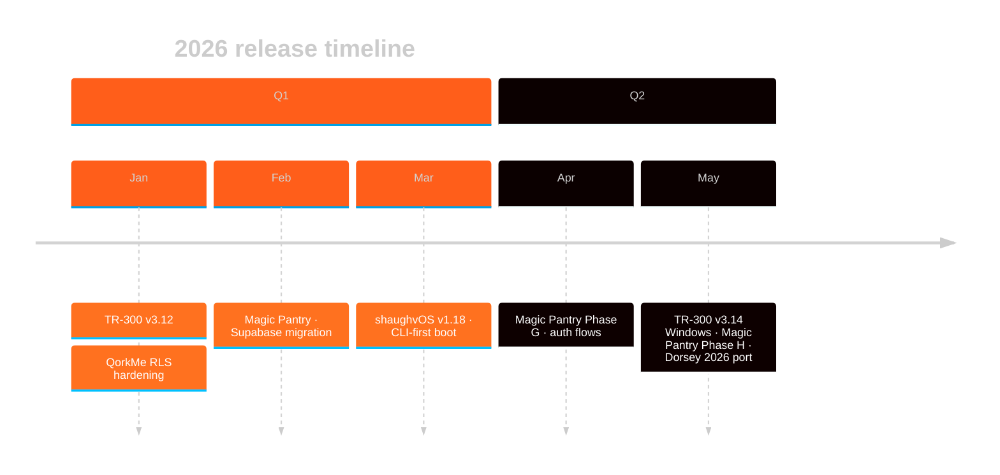

<!-- ====================================================================== -->
<!--  EMMETT SHAUGHNESSY · GITHUB PROFILE                                   -->
<!--                                                                        -->
<!--  Hand-built within the limits of GitHub's markdown sanitizer.          -->
<!--  No JavaScript, no CSS, no inline SVG, no GitHub Actions.              -->
<!--  Every dynamic element is GFM, a sanitizer-safe HTML tag, or a         -->
<!--  parameterized image URL rendered live on every page load.             -->
<!--                                                                        -->
<!--  Scroll to the COLOPHON at the bottom for the full catalogue of        -->
<!--  techniques used in this file.                                         -->
<!-- ====================================================================== -->

<picture>
  <source media="(prefers-color-scheme: dark)" srcset="https://capsule-render.vercel.app/api?type=waving&color=0:090909,100:204F20&height=200&section=header&text=EMMETT%20SHAUGHNESSY&fontColor=F5E0C5&fontSize=52&fontAlignY=38&desc=DIGITAL%20CRAFTSMAN&descSize=16&descAlignY=58&descAlign=50&animation=fadeIn">
  
</picture>

<picture>
  <source media="(prefers-color-scheme: dark)" srcset="https://readme-typing-svg.demolab.com?font=Fira+Code&weight=600&size=20&duration=2400&pause=1200&color=FF5E1A&center=true&vCenter=true&width=640&lines=full-stack+developer+%E2%80%94+rust+%2B+typescript;founder%2C+qube+tx+%E2%80%94+diagnostics+%26+web+studio;building+magic+pantry+%C2%B7+dorsey+2026+%C2%B7+shaughv+os;shipping+reliable+systems+since+2017">
  
</picture>

 

 

I build full-stack products, Rust diagnostics, and the systems that ship them &mdash; currently from a workshop of Qube TX, Magic Pantry, and Dorsey 2026.

<kbd> Jump to &mdash; </kbd>

&nbsp;

[`NOW`](#now) &nbsp;&middot;&nbsp; [`CURRENT WORK`](#current-work) &nbsp;&middot;&nbsp; [`STACK`](#stack) &nbsp;&middot;&nbsp; [`NUMBERS`](#numbers) &nbsp;&middot;&nbsp; [`COLOPHON`](#colophon)

---

## NOW

> [!NOTE]
> **MAY 2026 &mdash; actively shipping**
>
> &mdash; **TR-300 v3.14.x** &middot; Windows hardening (vswhere + winget MSVC preflight, Display-formatted errors)
> &mdash; **Magic Pantry** &middot; Phase H account self-service + sharing hardening for App Store launch
> &mdash; **Dorsey 2026** &middot; secondary-route parity + final QA on the Next.js 16 / React 19 rebuild

---

## CURRENT WORK

<table>
<tr>
<td width="50%" valign="top">

### [Qube TX](https://qubetx.com)
**Diagnostics tooling & web studio**

`Rust` `TypeScript` `Next.js` `CLI`

A growing ecosystem of Rust CLI diagnostics tools, all published to crates.io under canonical names. TR-300 is on the v3.14.x line as the `tr300` crate, recently hardened for Windows: a vswhere preflight that auto-installs MSVC Build Tools via winget so `cargo install` succeeds on a fresh machine, an execution-policy preflight, and a Display-formatted error path that maps native error codes to actionable advice. [`qube-network-diagnostics`](https://github.com/QubeTX/qube-network-diagnostics) (nd300 v3.0.x) ships hardened network-fix safety, an evidence-driven fix-loop with per-action stabilization windows, and a cargo-first / installer-fallback self-update chain that cleans up non-cargo installs on upgrade. [`qube-system-diagnostics`](https://github.com/QubeTX/qube-system-diagnostics) (SD-300, published as the `tr300-tui` crate) has a stabilized updater and runner-compatible release metadata. Around the CLIs sit the web surfaces &mdash; [`QubeTX_Landing`](https://github.com/QubeTX/QubeTX_Landing) and [`qube-machine-report-homepage`](https://github.com/QubeTX/qube-machine-report-homepage) (per-platform install one-liners, admin/sudo notes, and a chained `tr300 install` that writes the shell-profile alias and auto-run line in one paste) &mdash; plus the multi-provider [SpeedQX](https://github.com/QubeTX/speedtest) web app (bootstrap CIs, inverse-variance weighted aggregation, RFC 3550 jitter) and offline installer bundles ([`qube-reports-executables`](https://github.com/QubeTX/qube-reports-executables)). Also where most freelance / client work lives.

</td>
<td width="50%" valign="top">

### [QorkMe](https://qork.me)
**URL shortener**

`Next.js` `TypeScript` `Supabase` `Tailwind`

Custom aliases, click analytics, and a clean redirect layer on a Next.js + Supabase stack. Hardened Supabase RLS (INSERT policy on clicks, `SECURITY DEFINER` increment, owner-only UPDATE/DELETE, revoked TRUNCATE from anon/authenticated), bounded the URL redirect cache, optimized AdminLinksTable maxClicks, consolidated to a Makira-only typeface, and refreshed the admin dashboard.

</td>
</tr>
<tr>
<td width="50%" valign="top">

### shaughvOS
**Custom diagnostics OS**

`Shell` `Linux` `Build Pipelines`

Lightweight Debian-based diagnostics OS with Shaughv branding. The v1.20.0 line stabilized install + startup validation behind a focus-smoke shellcheck gate and a release-newline check, on top of v1.19.x's CLI-first boot, working `/usr/local/bin/` desktop shortcuts, Tailscale + Tor Browser pre-installs, an `autologin` command decoupled from `desktop on/off`, and apt-mark drift fixes. The full ~400-tool IT + security toolset is scoped and queued behind the stability work.

</td>
<td width="50%" valign="top">

### [Dorsey 2026](https://github.com/QubeTX/dorsey_2026_BETA)
**Music artist site**

`Next.js 16` `React 19` `Tailwind v4` `Framer Motion`

A full rebuild of a touring artist's site on Next.js 16 / React 19 / Tailwind v4, with shadcn/ui components and Framer Motion choreography. Pivoted from a custom Jazz-Bauhaus reinterpretation to a faithful recreation of the live leonleedorsey.com visual language &mdash; header / footer reworked, home / about / music / store / videos / contact and several press / gear pages rebuilt, mobile nav swapped to a full-screen white sheet, and Squarespace media imported locally to avoid hotlinking. Currently in secondary route parity and final QA.

</td>
</tr>
<tr>
<td width="50%" valign="top">

### Magic Pantry
**Cross-platform pantry app**

`Expo` `React Native` `Supabase` `Anthropic`

Full rebuild of the Magic Pantry app, migrated off the prior Replit + Express + Drizzle + Modelfarm stack onto Supabase (Postgres + Auth + RLS + Realtime) with Expo SDK 55 / React Native 0.83 / React 19.2 / React Navigation v7 / TanStack Query v5. AI features (item categorization on Claude Haiku 4.5, recipe generation on Sonnet 4.6, URL recipe import via Firecrawl v2 + Sonnet 4.6, plus a service-role `delete-account` for App Store compliance) run through edge functions. Phase H wired full account self-service &mdash; forgot / reset / change password, change username, signup-confirmation flow with 60s-cooldown resend &mdash; end-to-end via `magicpantry://` deep links for App Store launch, and tightened sharing so non-owner projections drop emails entirely and `findUserByUsernameOrEmail` returns username + id only. RLS helpers live in a `private` schema, `citext` was moved out of `public`, and usernames are `citext` for case-insensitive uniqueness.

</td>
<td width="50%" valign="top">

### [Personal Site](https://emmettshaughnessy.com)
**Portfolio & writing**

`TypeScript` `Next.js` `Tailwind` `Vercel`

Professional showcase, project index, and technical writing on a Next.js stack with a Pretext-powered responsive text layer, Lenis-driven smooth scroll, Anime.js choreography, and a forced-dark `/works` route whose filter rail wraps instead of scrolling on narrow viewports. Vercel Analytics in production; recent passes covered design-system docs, an explicit pre-push checklist in `CLAUDE.md`, and a Claude Code GitHub workflow with `pull-requests: write` so the bot can actually post its reviews.

</td>
</tr>
</table>

<strong>Also in the workshop &mdash;</strong> a dozen more repos &amp; surfaces

&nbsp;

Web surfaces around the Qube TX ecosystem ([`QubeTX_Landing`](https://github.com/QubeTX/QubeTX_Landing), [`qube-machine-report-homepage`](https://github.com/QubeTX/qube-machine-report-homepage), [`qube-reports-executables`](https://github.com/QubeTX/qube-reports-executables) for offline installers), the [SpeedQX](https://github.com/QubeTX/speedtest) web speed-test app and its parallel Expo / React Native port (v2.0 technician-grade accuracy overhaul, network metadata, jitter breakdown, bootstrap CI, inverse-variance weighting), `shaughv_vintage` (vintage-leaning personal portfolio with a Pretext-powered responsive text layer and a consolidated nav + project-card a11y pass), a print-tuned [`resume-2026`](https://resume.emmetts.dev) on Makira / Personal-Vogue that auto-deploys via GitHub Pages, [Time](https://github.com/RealEmmettS/time) (atomic-clock alternative to time.gov with a Marzullo-uncertainty-based watch score), Remotion-based programmatic video experiments, MDX docs sites, and a rotating cast of small utilities (timer, qrgen, csv tools, countdown apps, movie list).

---

## STACK

 

### Languages

### Frameworks &amp; libraries

### Cloud &amp; infrastructure

<strong>More on what I'm building right now &mdash;</strong> full breakdown

&nbsp;

- **TR-300 Windows hardening** &mdash; on the v3.14.x line for the `tr300` crate: vswhere preflight that auto-installs MSVC Build Tools via winget so cargo install succeeds on a fresh box, an execution-policy preflight, and a Display-formatted error path that maps native error codes to actionable advice. The TR-300 install one-liner now chains `tr300 install` so a single paste also writes the shell-profile alias and auto-run line.
- **Magic Pantry** &mdash; Replit → Supabase migration plus Phase H: account self-service (forgot / reset / change password, change username, signup-confirmation flow with 60s-cooldown resend, `magicpantry://` deep links) and a sharing-hardening pass that scopes shared-list member projections to usernames-only and keeps emails out of the user-lookup API. RLS helpers in a `private` schema, `citext` moved out of `public`, Realtime, and Anthropic + Firecrawl edge functions for categorization / recipe generation / URL recipe import / account deletion.
- **nd300 + SD-300** &mdash; `qube-network-diagnostics` v3.0.x hardened the network-fix loop with per-action stabilization windows and a cargo-first / installer-fallback self-update chain that cleans up non-cargo installs on upgrade; `qube-system-diagnostics` republished as the canonical `tr300-tui` crate with stabilized updater and runner-compatible release metadata. Both on an automated crates-publish pipeline with CI version checks.
- **shaughvOS** &mdash; Debian-based diagnostics OS on the v1.20.0 line: install / startup validation, a focus-smoke shellcheck gate, release-newline check, CLI-first boot, working desktop shortcuts via `/usr/local/bin/` symlinks, Tailscale + Tor Browser pre-installs, and an `autologin` command decoupled from `desktop on/off`.
- **Dorsey 2026** &mdash; touring artist's site rebuild on Next.js 16 / React 19 / Tailwind v4; in secondary route parity and final QA on the leonleedorsey.com port with imported Squarespace media.
- **Modern web stacks** &mdash; Next.js 16 / React 19 / Tailwind v4 / shadcn/ui builds for client sites and Qube TX surfaces (refreshed `qube-machine-report-homepage` with the chained one-liner installer, MSVC auto-install preflight on Windows, and per-platform admin / sudo notes), deployed on Vercel.
- **Full-stack product work** &mdash; QorkMe on Next.js + Supabase with hardened RLS (INSERT policy on clicks, `SECURITY DEFINER` increment, owner-only writes, revoked TRUNCATE), a bounded URL redirect cache with FIFO eviction, an O(N)-fix on `AdminLinksTable` maxClicks, and a consolidated Makira-only typography pass.
- **Cross-platform mobile** &mdash; Expo / React Native across Magic Pantry and the SpeedQX port carrying the v2.0 technician-grade accuracy overhaul (bootstrap CIs, inverse-variance weighting, AIM scores, byte-weighted progress) from the web app onto iPhone / iPad.
- **AI-assisted workflows** &mdash; pairing Claude / Codex agents into real product development; release pipelines moved from foreground `gh run watch` to non-blocking Monitor poll-loops, with `gh --jq` keeping the diff portable across machines without local jq.
- **Technical consulting** &mdash; pragmatic, end-to-end solutions for client work through Qube TX.

---

## NUMBERS

<table align="center" width="100%">
<tr>
<td width="50%" align="center">

<picture>
  <source media="(prefers-color-scheme: dark)" srcset="https://github-readme-stats.vercel.app/api?username=RealEmmettS&show_icons=true&count_private=true&include_all_commits=true&rank_icon=percentile&hide_border=false&bg_color=090909&title_color=FF5E1A&text_color=F5E0C5&icon_color=FF5E1A&border_color=204F20">
  
</picture>

</td>
<td width="50%" align="center">

<picture>
  <source media="(prefers-color-scheme: dark)" srcset="https://github-readme-streak-stats.demolab.com?user=RealEmmettS&background=090909&stroke=204F20&ring=FF5E1A&fire=FF5E1A&currStreakNum=F5E0C5&sideNums=F5E0C5&currStreakLabel=FF5E1A&sideLabels=F5E0C5&dates=C2A83E">
  
</picture>

</td>
</tr>
<tr>
<td width="50%" align="center">

<picture>
  <source media="(prefers-color-scheme: dark)" srcset="https://github-readme-stats.vercel.app/api/top-langs/?username=RealEmmettS&layout=compact&langs_count=10&hide=html,css&size_weight=0.5&count_weight=0.5&bg_color=090909&title_color=FF5E1A&text_color=F5E0C5&border_color=204F20">
  
</picture>

</td>
<td width="50%" align="center">

<picture>
  <source media="(prefers-color-scheme: dark)" srcset="https://github-readme-activity-graph.vercel.app/graph?username=RealEmmettS&bg_color=090909&color=F5E0C5&line=FF5E1A&point=FF5E1A&area=true&area_color=FF5E1A&hide_border=false&border_color=204F20&custom_title=COMMITS+OVER+52+WEEKS">
  
</picture>

</td>
</tr>
</table>

<picture>
  <source media="(prefers-color-scheme: dark)" srcset="https://github-profile-trophy.vercel.app/?username=RealEmmettS&theme=darkhub&no-frame=true&no-bg=true&column=7&rank=SECRET,SSS,SS,S,AAA,AA,A&margin-w=4">
  
</picture>

---

## COLOPHON

<strong>What this README actually does</strong> &mdash; the full catalogue of techniques

&nbsp;

This profile is a working demo of what GitHub's markdown renderer + HTML sanitizer currently allow inside a profile README. Every technique here is plain markdown, sanitizer-safe HTML, or a parameterized image URL &mdash; no GitHub Actions, no JavaScript, no CSS, no inline SVG, no Camo-bypassing tricks.

| Technique | Where it's used here |
|---|---|
| `<picture>` + `prefers-color-scheme` | Hero banner, typing SVG, all four stats cards, trophy row, footer banner |
| GFM alert (`> [!NOTE]`) | The `NOW` block |
| `
` / `
` (interactive) | TOC, workshop list, focus deep-dive, this colophon |
| Mermaid `mindmap` (themed via `init` directive) | `STACK` diagram |
| Mermaid `timeline` (themed via `init` directive) | 2026 release arc |
| Heading auto-anchors | TOC jump links (`#now`, `#current-work`, &hellip;) |
| `<kbd>` semantic tag | TOC summary chip |
| Camo-proxied animated SVGs | Capsule banner (SMIL `fadeIn`), typing SVG (CSS animation) |
| Live external widgets | `komarev` views &middot; shields.io last-push / followers / stars &middot; github-readme-stats &middot; github-readme-streak-stats &middot; top-langs (blended `size_weight` + `count_weight` for recency) &middot; activity-graph &middot; profile-trophy |
| Custom-themed shields | Every badge tuned to the SHAUGHV palette: `#090909` &middot; `#204F20` &middot; `#FF5E1A` &middot; `#C2A83E` &middot; `#F5E0C5` |
| `<table>` for grid layout | 2&times;3 projects, 2&times;2 numbers dashboard |
| HTML comments | Source-only annotations at the top of this file |
| HTML entities (`&mdash;`, `&middot;`, `&hellip;`) | Body copy, in lieu of literal Unicode for source readability |
| SHAUGHV voice (em-dash / mid-dot / slash punctuation) | Throughout body copy |

**Things the GitHub sanitizer blocks, that this README respects:** inline `<svg>`, `<script>`, `<style>`, `<iframe>`, `<form>`, `<button>`, `<video>`, `<audio>`, `class=`, `style=`, `target=_blank`. Everything is either pre-rendered server-side into an SVG and proxied through Camo, or written with one of the &sim;14 tags on the sanitizer's allowlist.

**Deferred to a future automation pass** (each needs a GitHub Action this repo doesn't yet have): the Platane/snk contribution-snake animation, lowlighter/metrics SVG dashboard, yoshi389111/github-profile-3d-contrib isometric grid, and a WakaTime card.

Sources for the renderer constraints: [html-pipeline](https://github.com/gjtorikian/html-pipeline) &middot; [GitHub blog on dark/light images](https://github.blog/developer-skills/github/how-to-make-your-images-in-markdown-on-github-adjust-for-dark-mode-and-light-mode/) &middot; [GitHub Mermaid docs](https://docs.github.com/en/get-started/writing-on-github/working-with-advanced-formatting/creating-diagrams).

---

<picture>
  <source media="(prefers-color-scheme: dark)" srcset="https://capsule-render.vercel.app/api?type=waving&color=0:204F20,100:090909&height=140&section=footer&text=BUILDING+RELIABLE+SYSTEMS&fontColor=F5E0C5&fontSize=22&fontAlignY=70&desc=EMMETT%40EMMETTS.DEV+%C2%B7+EMMETTSHAUGHNESSY.COM&descSize=12&descAlignY=88&descAlign=50">
  
</picture>
