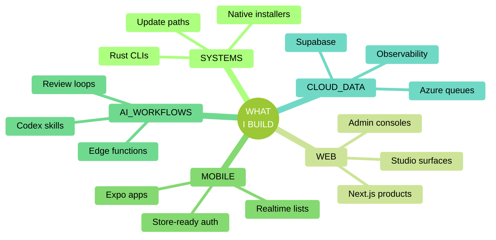

<!-- ====================================================================== -->
<!--  EMMETT SHAUGHNESSY - GITHUB PROFILE                                   -->
<!--                                                                        -->
<!--  GitHub-safe SHAUGHV surface. No JavaScript, no CSS, no inline SVG,    -->
<!--  no GitHub Actions. Built from GFM, sanitizer-safe HTML, Mermaid,      -->
<!--  shields, and theme-aware image URLs.                                  -->
<!-- ====================================================================== -->

<picture>
  <source media="(prefers-color-scheme: dark)" srcset="https://capsule-render.vercel.app/api?type=waving&color=204F20&height=190&section=header&text=EMMETT%20SHAUGHNESSY&fontColor=F5E0C5&fontSize=52&fontAlignY=38&desc=DIGITAL%20CRAFTSMAN&descSize=16&descAlignY=58&descAlign=50">
  
</picture>

 

**Rust diagnostics / agent tooling / full-stack product systems.**

I build operational software that survives real installers, real users, and real release loops. Current focus: Qube TX, WB-300, Magic Pantry, shaughv-code, and QorkMe.

<table>
<tr>
<td align="center" width="25%"><strong>CRATES + INSTALLERS</strong> Rust CLIs, native packages, update paths</td>
<td align="center" width="25%"><strong>AGENT WORKFLOWS</strong> Codex plugins, skills, branch control</td>
<td align="center" width="25%"><strong>PRODUCT SYSTEMS</strong> Mobile, web, auth, realtime, AI helpers</td>
<td align="center" width="25%"><strong>CLIENT DELIVERY</strong> Qube TX studio work and data platforms</td>
</tr>
</table>

<kbd> Jump to </kbd>

&nbsp;

[`LATEST SHIPS`](#latest-ships) &nbsp;&middot;&nbsp; [`SELECTED SYSTEMS`](#selected-systems) &nbsp;&middot;&nbsp; [`STACK`](#stack) &nbsp;&middot;&nbsp; [`NUMBERS`](#numbers) &nbsp;&middot;&nbsp; [`WORKSHOP ARCHIVE`](#workshop-archive) &nbsp;&middot;&nbsp; [`COLOPHON`](#colophon)

---

## LATEST SHIPS

> [!NOTE]
> **JUNE 2026, selected proof**
>
> &middot; **shaughv-code `v0.25.0`.** The personal Codex skill bundle now carries the SHAUGHV design system, audio, Mistral, security, workflow, image, storage, branch-control, and summary skills as one installable plugin. It is the portable tooling layer behind how I design, review, ship, and hand off work. [Repository](https://github.com/RealEmmettS/shaughv-code).
>
> &middot; **WB-300 `v2.0.0`.** The workbranch control tower models real git topology as repo / trunk / workbranch / task, then shows active branches, agents, lifecycle stage, worktree paths, and edited files in one terminal view. It turns multi-agent development from scattered tabs into an inspectable system. [Repository](https://github.com/QubeTX/qube-workbranch-view).
>
> &middot; **Magic Pantry `2.0.2`.** The pantry app moved to offline-first list durability and live collaborative merge: server-set timestamps, idempotency keys, realtime echo dedup, delete-evict, newer-wins, and field-preserving edits. The result is a grocery list that keeps working under bad signal and shared use. [Project notes](#workshop-archive).

---

## SELECTED SYSTEMS

<table>
<tr>
<td width="11%" valign="top"><strong>001</strong> SYSTEMS</td>
<td width="61%" valign="top">

### [Qube TX](https://qubetx.com)
`Rust` `TypeScript` `Next.js` `CLI`

Diagnostics tooling and web studio work centered on Rust CLIs, installers, updater reliability, and the marketing surfaces that explain them. TR-300 has shipped as a canonical crate with native Windows distribution, cross-platform collector hardening, installer hash checks, profile-write safeguards, and single-install migration cleanup.

</td>
<td width="28%" valign="top">

**Evidence**

[TR-300](https://github.com/QubeTX/qube-machine-report) 
[Qube TX site](https://github.com/QubeTX/QubeTX_Landing) 
[SpeedQX](https://github.com/QubeTX/speedtest)

</td>
</tr>
<tr>
<td width="11%" valign="top"><strong>002</strong> WORKFLOW</td>
<td width="61%" valign="top">

### [WB-300](https://github.com/QubeTX/qube-workbranch-view)
`Rust` `TUI` `Git` `Agents`

A terminal control tower for agent-driven development. It derives branch hierarchy from commit topology, exposes a `wb300.agent.v2` JSON contract, sends OS notifications on important state changes, and gives coding agents a shared map of the workbranch system.

</td>
<td width="28%" valign="top">

**Evidence**

[Repository](https://github.com/QubeTX/qube-workbranch-view) 
`v2.0.0` topology model 
Machine-wide tree view

</td>
</tr>
<tr>
<td width="11%" valign="top"><strong>003</strong> MOBILE</td>
<td width="61%" valign="top">

### Magic Pantry
`Expo` `React Native` `Supabase` `Anthropic`

A rebuilt cross-platform pantry app on Supabase, Expo, Realtime, RLS, and AI edge functions. Recent work made the list offline-first and collaborative, with durable queue replay, row-level merge rules, AI categorization, recipe generation, URL import, substitutions, and App Store-ready auth flows.

</td>
<td width="28%" valign="top">

**Evidence**

Offline queue 
Realtime merge 
AI list helpers

</td>
</tr>
<tr>
<td width="11%" valign="top"><strong>004</strong> AGENTS</td>
<td width="61%" valign="top">

### [shaughv-code](https://github.com/RealEmmettS/shaughv-code)
`Codex` `Skills` `MCP` `Design`

My personal Codex plugin and skill library. It packages practical operating systems for design, reasoning, security review, audio, Mistral API work, human changelogs, branch control, status lines, image work, storage, handoffs, and summary conventions into one portable repository.

</td>
<td width="28%" valign="top">

**Evidence**

[Repository](https://github.com/RealEmmettS/shaughv-code) 
`v0.25.0` plugin 
SHAUGHV design skill

</td>
</tr>
<tr>
<td width="11%" valign="top"><strong>005</strong> WEB</td>
<td width="61%" valign="top">

### [QorkMe](https://qork.me)
`Next.js` `Supabase` `Rust` `Analytics`

A URL shortener with custom aliases, click analytics, admin reporting, a public shorten API, and the `qork` Rust CLI. The current system includes installer cards, source attribution, analytics RPCs, pure-CSS charts, and a cleaner Qube TX design language across the product.

</td>
<td width="28%" valign="top">

**Evidence**

[Live app](https://qork.me) 
[qork CLI](https://github.com/QubeTX/qork) 
Admin analytics

</td>
</tr>
</table>

---

## STACK

 

### Working Set

---

## NUMBERS

 

<table align="center" width="100%">
<tr>
<td width="50%" align="center">

<picture>
  <source media="(prefers-color-scheme: dark)" srcset="https://streak-stats.demolab.com?user=RealEmmettS&background=204F20&stroke=F5E0C5&ring=F5E0C5&fire=F5E0C5&currStreakNum=F5E0C5&sideNums=F5E0C5&currStreakLabel=F5E0C5&sideLabels=F5E0C5&dates=F5E0C5">
  
</picture>

</td>
<td width="50%" align="center">

<picture>
  <source media="(prefers-color-scheme: dark)" srcset="https://github-readme-stats.vercel.app/api/top-langs/?username=RealEmmettS&layout=compact&langs_count=10&hide=html,css&size_weight=0.5&count_weight=0.5&bg_color=204F20&title_color=F5E0C5&text_color=F5E0C5&border_color=F5E0C5">
  
</picture>

</td>
</tr>
</table>

<picture>
  <source media="(prefers-color-scheme: dark)" srcset="https://github-readme-activity-graph.vercel.app/graph?username=RealEmmettS&bg_color=204F20&color=F5E0C5&line=F5E0C5&point=F5E0C5&area=true&area_color=F5E0C5&hide_border=false&border_color=F5E0C5&custom_title=COMMITS+OVER+52+WEEKS">
  
</picture>

---

## WORKSHOP ARCHIVE

<strong>Release ledger,</strong> selected depth

&nbsp;

- **TR-300 v3.17.0.** Migrate-cleanup detects and removes previous install kinds when installing through a new channel, so Windows installer, cargo, and bare-binary installs do not fight each other. It follows the v3.16.0 stability pass across collectors, output, builds, install/update behavior, self-update reliability, and test coverage.
- **QubeTX_Landing v3.2.0.** The studio site added a self-documenting design-system page, live terminal kit, downloadable brand kit, ScrollTrace, stat count-ups, and a denser product-line story.
- **Magic Pantry 2.0.2.** Offline-first durability and realtime merge sit on top of Phases I-L: smart entry, recipe library, substitutions, sort modes, store-ready auth, EAS production wiring, and Supabase migration tooling.
- **shaughv-code v0.25.0.** The skill bundle now spans design, audio, Mistral, Quiver, security, changelogs, branch control, image work, storage, handoff, learning, productivity, and TT;DR summaries.
- **qork CLI v1.1.1.** The terminal shortener ships native installers, liveness checks, `qork help`, origin-aware uninstall, installer-preferred updates, and source attribution back into QorkMe analytics.

<strong>Secondary surfaces,</strong> public workshop

&nbsp;

- **SHAUGHV brand system.** `shaughv-cdn` hosts versioned brand assets, fonts, and static/animated mark drop-ins behind a manifest at [`cdn.shaughv.com/tree.json`](https://cdn.shaughv.com/tree.json). `shaughv_vintage` carries the cream-and-sage personal portfolio variant, Pretext text fitting, scrollspy, dot-field motion, and project-level automation.
- **Video and media.** `italy-trip-video` is a Remotion birthday-trip slideshow with timed captions and a CapCut polish path. It was scaffolded through the video workflow in `shaughv-code`.
- **Web tools.** `qrgen` is a QR-code generator and AI styling surface with a SHAUGHV product UI. `realtime2_test` is an OpenAI Realtime API voice-agent prototype with pure shared handlers across Express and Vercel functions.
- **Qube TX surfaces.** [`qube-machine-report-homepage`](https://github.com/QubeTX/qube-machine-report-homepage), [`qube-reports-executables`](https://github.com/QubeTX/qube-reports-executables), SpeedQX, nd300, and SD-300 sit around the main diagnostics product line.
- **Client and artist sites.** [Dorsey 2026](https://github.com/QubeTX/dorsey_2026_BETA) rebuilds a touring musician's web presence on the modern Next.js / React / Tailwind stack while preserving the original visual language.

<strong>Private systems,</strong> summarized without repo links

&nbsp;

- **Data ingestion platform.** Webhook-driven incremental tier with Service Bus, queue-scaled workers, idempotent `updated_at` precedence, parity checks against nightly batch, App Insights observability, and metadata-driven polling cadence.
- **Monthly reporting tool.** Regenerate flows, versioned narrative snapshots, undo/history, editorial PDF work, photo handling, upstream retry/backoff, form-field validation, and client-safe messaging around rate limits.
- **Scorecards and task queues.** Visual Snapshot charts, scoped office filters, project-detail layout work, operator-aware task updates, reorder race fixes, and internal tool distribution through a team plugin.

---

## COLOPHON

<strong>What this README actually does,</strong> the profile renderer catalogue

&nbsp;

This profile is a GitHub-safe SHAUGHV translation: type-forward, proof-first, cream/forest only, and built inside GitHub's markdown sanitizer. The page avoids custom CSS, JavaScript, inline SVG, iframes, forms, new-tab attributes, and repo-local Actions.

| Technique | Where it is used here |
|---|---|
| `&lt;picture&gt;` + `prefers-color-scheme` | Header banner, streak card, top-langs card, activity graph, footer banner |
| GFM alert (`> [!NOTE]`) | `LATEST SHIPS` |
| `
` / `
` | TOC, archive sections, colophon |
| HTML tables | Hero proof strip, selected systems, paired stats cards |
| Mermaid `mindmap` | `STACK` operating map |
| Live shields | Contact pills, profile metrics, stack badges |
| Theme-aware widget cards | Streak, top languages, activity graph |
| Heading auto-anchors | TOC links |
| HTML entities | Mid-dot separators, non-breaking spacing, escaped symbols |

Blocked by design: inline SVG, script tags, style attributes, class attributes, iframes, forms, video, audio, and new-tab target attributes. Everything visible here is plain markdown, sanitizer-safe HTML, Mermaid, or a parameterized image URL.

Deferred unless this repo's no-Actions rule changes: generated contribution animations, lowlighter-style metrics dashboards, 3D contribution grids, and WakaTime cards.

Renderer references: [html-pipeline](https://github.com/gjtorikian/html-pipeline), [GitHub dark/light images guidance](https://github.blog/developer-skills/github/how-to-make-your-images-in-markdown-on-github-adjust-for-dark-mode-and-light-mode/), and [GitHub Mermaid docs](https://docs.github.com/en/get-started/writing-on-github/working-with-advanced-formatting/creating-diagrams).

---

<picture>
  <source media="(prefers-color-scheme: dark)" srcset="https://capsule-render.vercel.app/api?type=waving&color=204F20&height=140&section=footer&text=BUILDING+RELIABLE+SYSTEMS&fontColor=F5E0C5&fontSize=22&fontAlignY=70&desc=HEY%40EMMETTS.DEV+%C2%B7+EMMETTSHAUGHNESSY.COM&descSize=12&descAlignY=88&descAlign=50">
  
</picture>
